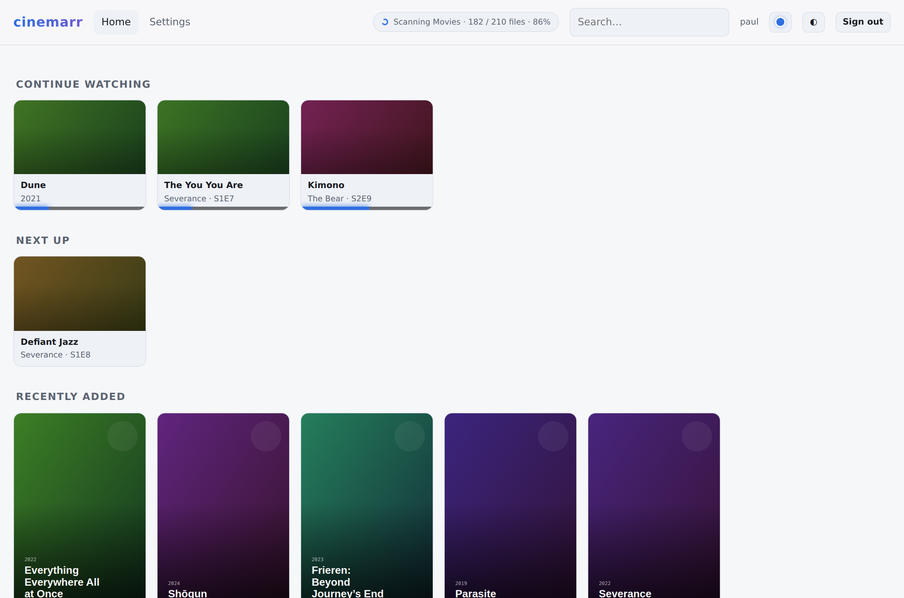
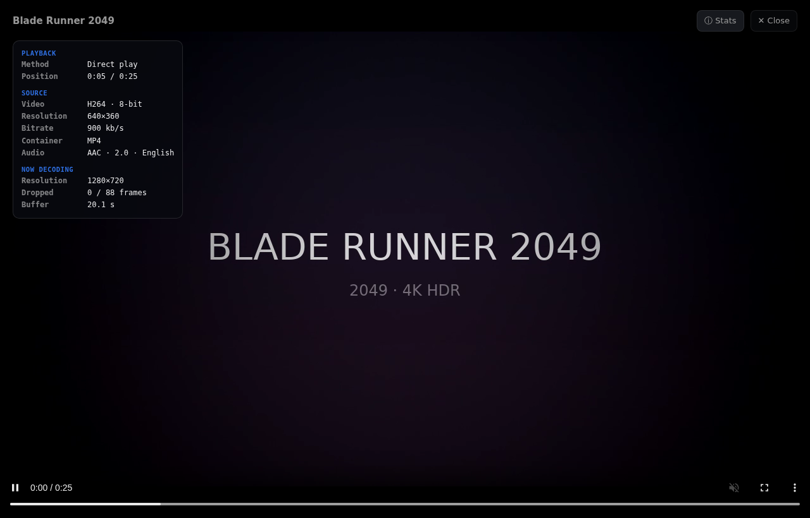
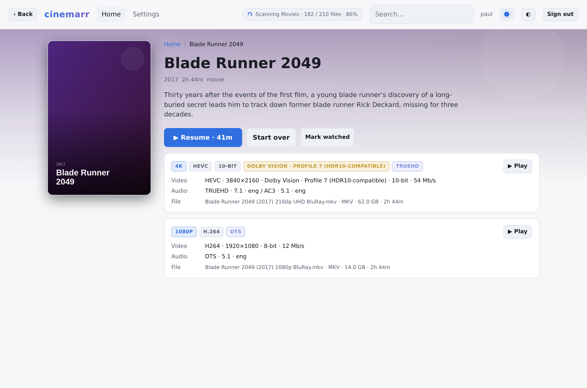
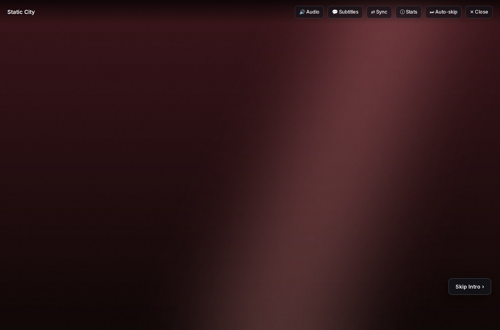
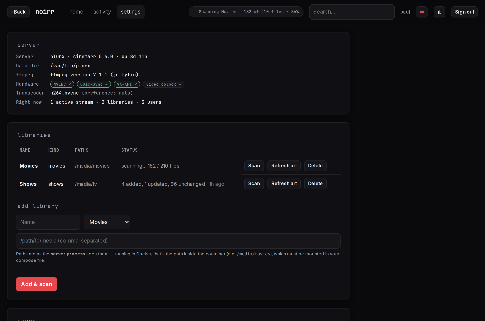
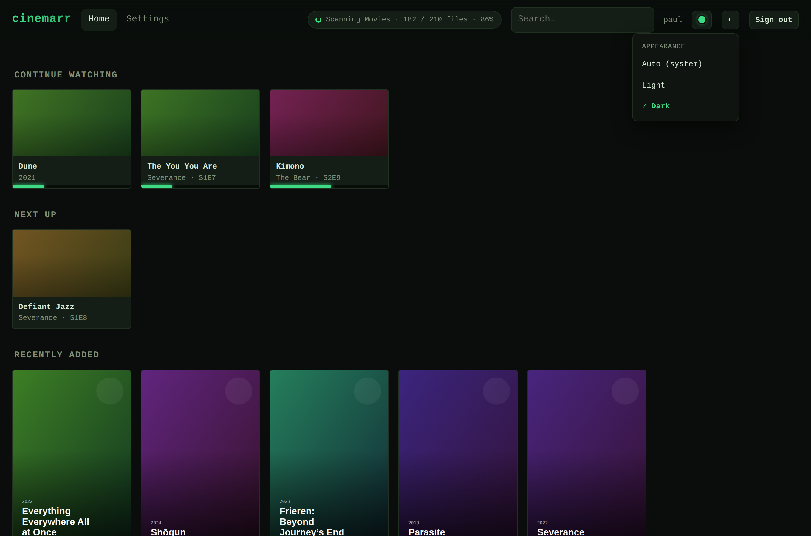

# plurx

[](https://github.com/pjunod/plurx/actions/workflows/ci.yml)
[](https://codecov.io/gh/pjunod/plurx)

A self-hosted media server and player in the spirit of **old-school Plex** —
before the streaming tiles, live TV, ads, and cloud accounts. Your media, your
hardware, your network: one lean Rust binary, a web app that doubles as the admin
UI, a Plex-compatible API so existing clients just work, and the thing no media
server has ever shipped — **real high-availability clustering**. Music, photos,
and live TV are out of scope on purpose (see [non-goals](#non-goals)).

> **Self-hosted and pre-1.0.** plurx runs on your LAN with no cloud dependency and
> never phones home. It mounts your media **read-only** and never writes, renames,
> or deletes a file. Today it runs as a **single node** — the HA cluster is
> decided and validated (Phase 3 spike) but not yet wired up (Phase 4). Treat it
> as a capable daily driver, not a backup of your only copy.



## Start here

New to the project? Read in this order. [docs/FEATURES.md](docs/FEATURES.md) is
the shortest answer to *what does this actually do* — the exhaustive inventory,
including what it deliberately doesn't. Then [docs/OPERATIONS.md](docs/OPERATIONS.md)
for running it day to day and reading every status and log line it shows you, with
[docs/CHEATSHEET.md](docs/CHEATSHEET.md) as the copy-paste quickstart beside it.
[docs/ARCHITECTURE.md](docs/ARCHITECTURE.md) has the diagrams and the founding
decisions (why one binary clusters without external infra), and
[docs/PLAYBACK.md](docs/PLAYBACK.md) traces the end-to-end path a file takes to
become a stream — every direct/remux/transcode fork and the per-browser
transport choice behind it. Scope and the phased
plan live in [docs/REQUIREMENTS.md](docs/REQUIREMENTS.md) and
[docs/ROADMAP.md](docs/ROADMAP.md); client strategy in
[docs/CLIENTS.md](docs/CLIENTS.md); the trust model — who can reach what, and
what plurx leaves to the reverse proxy — in [docs/SECURITY.md](docs/SECURITY.md);
deploy recipes in [deploy/README.md](deploy/README.md).

## What it looks like

A borderless, projection-style player: the title and controls auto-hide during
playback, a staged loading overlay replaces the mystery gray screen, and an ⓘ
stats overlay shows source → what your browser is actually decoding — plus Skip
Intro / Skip Credits from real chapter markers.



Every item shows its versions with labeled specs — a 2160p Dolby Vision remux and
a 1080p encode on one title, each with full video/audio/file detail:



<details>
<summary>More screenshots — Skip Intro, Settings, and a second theme</summary>

The Skip Intro button appears when playback enters a marked region (chapters, or a
conservative end-credits estimate); auto-skip is an opt-in preference:



The admin Settings page: server + hardware at a glance (green pills are encoders
that passed a real startup probe), libraries with **live** scan status, users,
metadata key, and a live log viewer:



Theming follows the system light/dark and offers named themes — here the **Terminal**
theme (true-black, monospace):



</details>

## Principles

1. **Your media, your rules.** No cloud dependency, no phone-home, no externally
   hosted accounts. Everything works on a LAN that never touches the internet.
2. **Direct play first.** The server's job is to get out of the way — every
   client uses hardware decoding, and plurx only remuxes or transcodes when a
   device truly can't handle the file, using hardware encoders when it must.
3. **Lean and boring to operate.** One static binary. No external database,
   message broker, or sidecar. Run one node, or run three identical binaries and
   they form an HA cluster.
4. **HA is a feature, not an ops project.** Active-active nodes over shared
   storage; settings, users, watch state, and playback sessions replicate — a
   node dying mid-movie costs seconds, not your evening.
5. **Meet clients where they are.** A native API for our own apps, plus a Plex
   Media Server-compatible API so existing third-party Plex clients point at
   plurx and just work.

## Quickstart

The fast path with Docker/Compose — from nothing to playing in four steps:

```bash
# 1. Point it at your media and bring it up (builds from source the first time)
cd deploy
cp docker-compose.override.example.yml docker-compose.override.yml
$EDITOR docker-compose.override.yml     # media mounts as host:container:ro, + optional GPU
docker compose up -d --build

# 2. Open the web app — the first launch is the admin-account setup screen
open http://<host>:32600                # :32600 is the default port

# 3. Add a library: Settings → Libraries → Add & scan
#    Kind: Movies | TV Shows | Anime · Path: what the SERVER sees (the container mount)

# 4. Press play. Open ⓘ Stats (or press i) to see how it's being served.
```

Movies and TV want a free TMDB key for posters and metadata (Settings →
Metadata); anime enriches from AniList with no key. Everything runtime — users,
libraries, keys — is edited in Settings, never a config file. A scan that finds
nothing almost always means the path isn't what the server sees; the fix is in
[docs/OPERATIONS.md](docs/OPERATIONS.md#reading-library-scan-status).

## Install

Three ways to run it; all serve the web app + API on `:32600`.

```bash
# Docker / Compose — recommended for homelabs; bundles ffmpeg, builds from source first run
cd deploy && docker compose up -d --build

# Bare metal — one static binary; needs ffmpeg/ffprobe on PATH
#   (jellyfin-ffmpeg recommended, or point PLURX_FFMPEG / PLURX_FFPROBE at them)
plurxd run

# From source (development)
cargo run -p plurxd                     # or: make run
```

**Prerequisites.** Just `ffmpeg`/`ffprobe`, for scanning and remux/transcode —
the Docker image already bundles them. Hardware transcoding additionally needs
the GPU exposed to the process (NVENC / QuickSync / VA-API / VideoToolbox) and
its driver; the software x264 path is always there as a fallback. Configuration
layers defaults → `plurx.toml` → `PLURX_*` env (full table in
[docs/OPERATIONS.md](docs/OPERATIONS.md#configuration-surface)).

**Full guides.** [deploy/README.md](deploy/README.md) is the complete
**install & setup** reference — every target (Compose, bare metal, a systemd
service on Linux, a launchd agent on macOS, Unraid, TrueNAS/Kubernetes), GPU
passthrough, and ports.
[docs/OPERATIONS.md](docs/OPERATIONS.md) is **operations** — running it day to
day and reading every status, log, and stats line it shows you.
[docs/CHEATSHEET.md](docs/CHEATSHEET.md) is the **cheat sheet** — the
copy-paste commands, in order, plus a table of where everything lives.

## Development

Rust is the only toolchain to install — the repo pins the exact rustc, clippy,
and rustfmt in [`rust-toolchain.toml`](rust-toolchain.toml), so `rustup` fetches
the right versions on your first build. Local and CI stay identical, which is
why a green `make check` locally means green in CI. Keep `ffmpeg`/`ffprobe` on
`PATH` for anything that scans or plays.

```bash
git clone https://github.com/pjunod/plurx && cd plurx
make run          # build + serve http://localhost:32600  (cargo run -p plurxd)
make check        # fmt-check + clippy + test — the CI gate, the single quality bar
make hooks        # install a pre-commit hook that runs `make check` before each commit
```

Everything goes through the `Makefile`; `make` with no target lists them all
(`make test`, `make coverage` → `lcov.info`, `make docker`). One gotcha worth
knowing up front: the web app is a single file embedded into the binary at build
time ([`crates/plurxd/src/web/index.html`](crates/plurxd/src/web/index.html)),
so a UI change only shows up after a rebuild. How the pieces fit and *why* is
[docs/ARCHITECTURE.md](docs/ARCHITECTURE.md); the crate map is [below](#layout).

## Usage

**Add a library.** Settings → Libraries → *Add & scan*. Pick Movies, TV Shows, or
Anime; give it one or more paths. The scanner identifies files, probes them with
`ffprobe`, and enriches from TMDB (movies/TV, optional key) or AniList (anime, no
key). Watch the live status: `scanning… N / M files` → `fetching metadata…` →
`idle`. A scan that finds nothing almost always means the path isn't what the
server sees — see [OPERATIONS.md](docs/OPERATIONS.md#reading-library-scan-status).

**Play something.** Press play; plurx decides direct-play / remux / transcode for
your device and reports it. Open the **Stats** overlay (ⓘ or press `i`) to see the
method, source, and what your browser is actually decoding. *Direct play* is
ideal, *Remux* is cheap, *Transcode · QuickSync* means the GPU is working,
*Transcode · software* means it fell back to CPU (the logs say why).

**Point a Plex client at it.** Kodi-family Plex clients (Composite, PKC),
`python-plexapi`, and Home Assistant work against the Plex-compat façade + GDM
discovery — no plex.tv contact. See [docs/CLIENTS.md](docs/CLIENTS.md).

**Operate it.** `/healthz`, `/readyz`, and Prometheus `/metrics`; a global
activity pill shows what the server is doing on every page; Settings → Logs is a
live, filterable log viewer. Full guide: [docs/OPERATIONS.md](docs/OPERATIONS.md).

## Layout

| Path | What's inside |
|---|---|
| [`crates/plurx-core`](crates/plurx-core) | Domain model · the `Store` trait · scanner · metadata agents · playback decision engine |
| [`crates/plurxd`](crates/plurxd) | The HTTP daemon (axum) · transcode orchestrator · the embedded single-file web app |
| [`crates/plurx-compat-plex`](crates/plurx-compat-plex) | Plex Media Server API façade + GDM discovery responder |
| [`docs/`](docs) | Architecture · playback · features · operations · cheat sheet · requirements · roadmap · clients |
| [`deploy/`](deploy) | Docker/Compose, systemd unit, macOS launchd agent, and Unraid templates |

## Status

Phases are gates — each ends with something you actually use. Full detail in
[docs/ROADMAP.md](docs/ROADMAP.md).

- [x] **Phase 0 — Skeleton.** Workspace, CI (fmt/clippy/test, cross-build), Docker
  image, `Store` trait boundary from commit one.
- [x] **Phase 1 — It plays.** Scanner, TMDB metadata, native API, direct play +
  remux, resume, embedded web app.
- [x] **Phase 2 — Old-Plex parity.** Hardware transcode (NVENC/QSV/VA-API/
  VideoToolbox + software fallback) with HDR→SDR tone-mapping and HLS; anime
  (AniList, absolute numbering, dual-audio); multi-version items; subtitles;
  Plex-compat Tier 1 (validated with `python-plexapi`); ops (metrics, logs,
  deploy templates).
- [x] **Phase 3 — Cluster spike.** The HA decision gate: store backend (hiqlite)
  and transcode-failover mechanic decided and validated against real sources. See
  [docs/PHASE3-SPIKE.md](docs/PHASE3-SPIKE.md).
- [~] **Playback experience.** Borderless player, staged loading, rich stats, skip
  intro/credits with auto-skip — shipped. Public ratings and multi-server
  dashboard still to come.
- [ ] **Phase 4 — HA for real.** `HiqliteStore` behind the unchanged `Store`
  trait, replicated sessions, client-retry failover, Helm chart, failure-drill
  tests.
- [ ] **Phase 5 — Native clients.** Android/Google TV → Apple TV → Tizen/webOS →
  Roku, each with a device profile and the shared correctness corpus.

## Non-goals

Deliberate, with reasons — the full list and rationale is in
[docs/ARCHITECTURE.md](docs/ARCHITECTURE.md#8-non-goals-what-the-architecture-deliberately-refuses)
and [docs/FEATURES.md](docs/FEATURES.md#11-what-plurx-does-not-do):

- **No cloud, no phone-home.** There is no plurx.tv and there never needs to be.
- **plurx never writes your media.** Read-only mounts; no organizing, renaming, or
  deleting.
- **Not a streaming aggregator.** No ads, no live TV, no rentals, no "discover"
  feeds.
- **No music or photos** in v1 (the data model won't preclude them later).
- **No transcode-by-default.** On demand only, when a device forces it.

## License

Private for now. Licensing will be decided if/when the project is shared.
