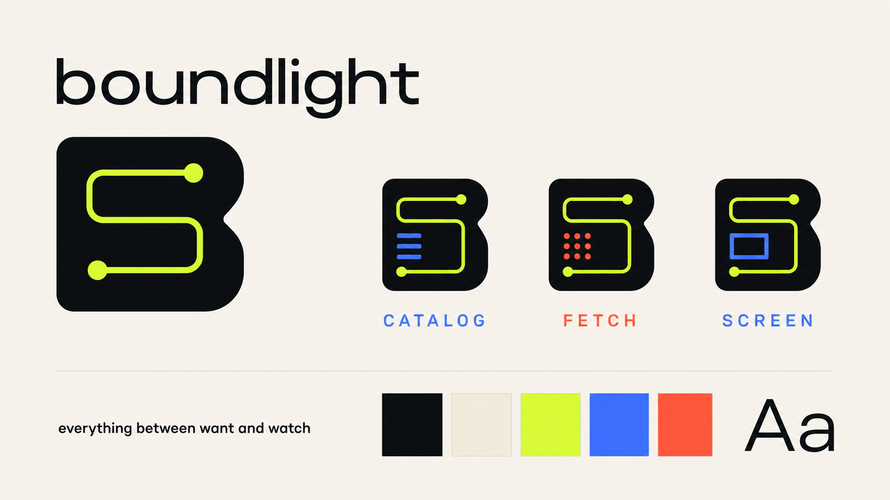
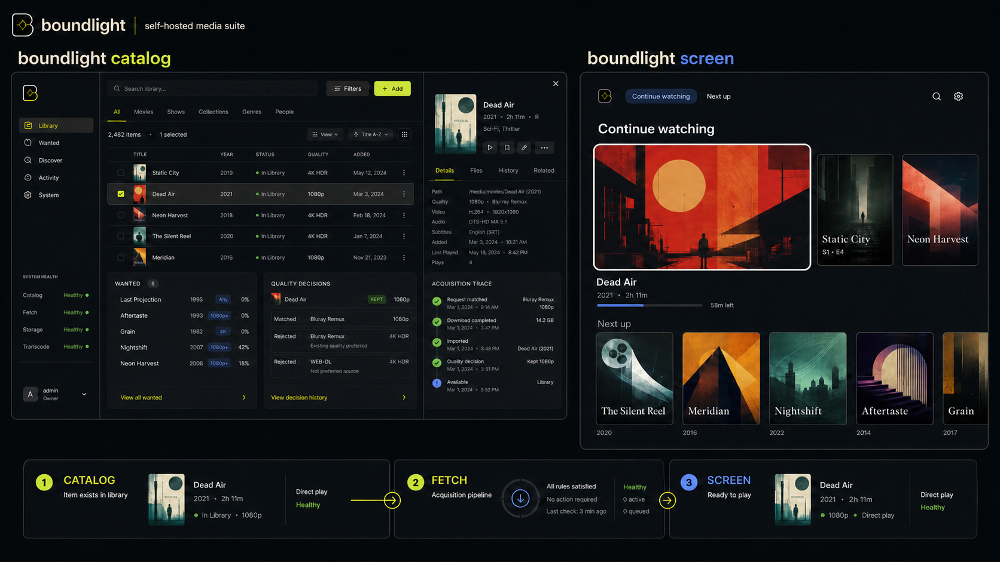

# Brand exploration — one system from wanted to watching

**Status:** direction, not a rename decision · **Written:** 2026-07-30

Companion to [BRAND.md](BRAND.md), which records the existing `noirr`
direction. This document tests a different premise: leave the `*arr` family
entirely, use one master brand for all three applications, and make the tight
integration visible without pretending that a downloader and a television UI
need the same layout. The generated concept inputs are recorded in
[exploration/PROMPTS.md](exploration/PROMPTS.md).

No repository, executable, API, bundle identifier, or compatibility surface is
renamed by this exploration.

## Recommendation — build one suite brand, not a media company

Use one public master brand with descriptive product names:

| Public name | Current project | Job |
|---|---|---|
| **Boundlight Catalog** | `monarr` | Knows what you have and want · finds, judges, imports, and organizes it |
| **Boundlight Fetch** | `nzbd` | Downloads, repairs, extracts, and hands off the finished package |
| **Boundlight Screen** | `plurx` | Serves the library and plays it on web, mobile, and television clients |

`Boundlight` should be the project and suite name. If a legal entity is ever
needed for signing accounts or contracts, `Boundlight Systems` is broad enough
without presenting a one-maintainer open-source project as a fictional studio.
Do not create a separate "media company" layer until something outside these
products actually needs one.

This architecture spends one memorable name rather than four. That is the right
trade because the strongest product claim is not any single replacement; it is
that one observable path connects a wanted title to a playable file.

```text
 Boundlight Catalog          Boundlight Fetch           Boundlight Screen
 knows and decides ────────▶ moves and verifies ──────▶ serves and plays
          ▲                                                   │
          └────────────── watch state and identifiers ────────┘
```

**Positioning:** A local-first media system that takes a title from wanted to
watching without a cloud account or a chain of brittle integrations.

**Lead line:** Everything between want and watch.

**Supporting line:** Your library · your hardware · one observable path.

## Why `boundlight` earns a second round

The name carries several parts of the product without describing one
implementation:

- **Bound** means contained and under the operator's control. It also reaches
  books naturally, which a cinema-only name does not.
- **Light** is playback, projection, and signal. It gives the identity motion
  and a visual primitive without requiring a film reel or play triangle.
- **Bound light** is a useful product metaphor: media crosses the stack, but
  the operator chooses the boundary. No vendor account sits in the path.
- It is pronounced exactly as written and survives a sentence, a package name,
  an Apple TV tile, and a Kubernetes label.

A preliminary exact-string web search on 2026-07-30 found no obvious
software/media product using `boundlight`, and a GitHub repository-name search
returned no result. That is discovery, not clearance. Domain registration,
package namespaces, company registers, and trademark classes have not been
cleared and must be checked privately before the name appears in a public
release.

### The names this direction replaces

| Name | Keep | Problem as the public suite brand |
|---|---|---|
| `noirr` | Keep the existing kit as a complete alternate concept | The double `r` deliberately keeps the family accent; noir also narrows a suite that includes books and general media |
| `plurx` | Keep as the current server/repository codename until a rename is chosen | It is visually and phonetically close to Plex in the same product category; making it the parent amplifies that dependency |
| `monarr` | Keep compatibility paths and internal migration references | It explains the origin but makes the replacement sound like another member of the family it is leaving |
| `nzbd` | Keep protocol names and compatibility documentation where technically accurate | It reads as an implementation abbreviation, not a product someone can recommend aloud |

The current names do not need to disappear in one commit. Compatibility names
are contracts; public names are presentation. Change the presentation first
and retire technical identifiers only when the breakage has somewhere useful
to go.

## Naming guardrails — what the final name must survive

Judge a replacement against these constraints before drawing its logo:

1. **It names the suite, not one transport.** Usenet, Plex compatibility, a
   specific language, and the current three-process topology can all change.
2. **It works in speech.** A user should hear it once and type it without being
   told which letters are doubled.
3. **It is not a parody of the replaced product.** The origin story can win the
   first click; a derivative name caps the identity forever.
4. **It has a visual primitive.** A boundary and a line can form a durable
   system. A joke spelling usually cannot.
5. **It is broad enough for books and future clients.** Cinema language alone
   turns a current feature into a permanent exception.
6. **It tolerates descriptive products.** `Catalog`, `Fetch`, and `Screen`
   should clarify the jobs instead of fighting the master brand.

Several attractive alternatives fail early.
[Unspool](https://www.unspool.app/) has a direct media-app collision.
[Freehold](https://freeholdtools.com/) is already used by software positioned
around permanent ownership. [Signalbound](https://signalbound.art/) has live
software, game, and media-studio collisions.
[Asterism](https://mkships.app/asterism/terms/) is an active app name and is
also used by an [open-source framework](https://tangled.org/aly.codes/asterism).
The point of a coined name is not novelty by itself; it is a clean path to being
found.

## Visual system — a boundary, one line, three states



The board above is generated exploration, not production artwork. Its useful
idea is the shared line inside a fixed boundary. The literal circuit-shaped
`B/S` mark needs another drawing round: at small sizes it risks reading as
generic networking or fintech.

### Core identity

| Token | Value | Job |
|---|---|---|
| Carbon | `#0B0D10` | Shells, icon field, projection background |
| Bone | `#F2EEE5` | Primary text and the light-theme canvas |
| Signal | `#D8FF4F` | The one path through the suite · focus · active progress |
| Catalog | `#5877FF` | Product identification, never generic information |
| Fetch | `#FF6B4A` | Product identification, never a substitute for error |

Signal chartreuse belongs on carbon, not as small text on bone. Product colors
identify an application; semantic colors still identify healthy, warning, and
failed states. A red Fetch badge cannot also mean failure, because a state that
changes meaning by page is not a state.

**Wordmark:** use a custom-drawn lowercase `boundlight` wordmark with a normal
sans-serif rhythm. Do not repeat `noirr`'s monospace-cursor construction; a new
name should look like a decision, not a reskin.

**Interface type:** keep Inter and JetBrains Mono for now. They already serve
the content/system split, are legible, and do not force three mature interfaces
through a font migration. Native Apple clients should use the platform text
styles so Dynamic Type and television focus behavior remain first-class.

**Icon family:** one carbon squircle · one boundary silhouette · one signal
line. Catalog, Fetch, and Screen may alter the line's internal state, but not
the outer silhouette. At 32 px and below, remove secondary product detail and
use the master mark.

**Motion:** the line is still when idle, travels when work is in flight, and
resolves to a fixed point when the item is playable. Motion communicates state;
it is not ambient decoration, and `prefers-reduced-motion` gets the same
information as a static shape.

## Layout system — related siblings, not identical skins



The generated board deliberately exaggerates density to test the system. It is
not a screen specification; every title and piece of artwork is fictional. The
durable decision is to support two shells.

### Desk shell — Catalog and Fetch

Catalog and Fetch are operator tools. Give them a compact left rail, a command
and search row, a dense primary work surface, and a contextual inspector that
opens without losing the list underneath.

- **Catalog:** library and wanted state in the main surface · quality and
  acquisition reasoning in the inspector · discovery as a mode, not the home
  page's entire personality.
- **Fetch:** queue and throughput in the main surface · provider, article, and
  post-processing evidence in the inspector · history adjacent to the queue,
  not in a disconnected visual world.
- **Both:** keyboard-first on desktop · touch-safe at tablet widths · a bottom
  sheet instead of a crushed inspector on phones.

Density is not clutter when the hierarchy is honest. The operator should see
more state with fewer page changes, not more decoration per square inch.

### Sofa shell — Screen

Screen is a content and playback surface. It keeps horizontal rails, large
artwork, minimal navigation, and focus targets readable from a sofa. Do not put
an admin rail on Apple TV to prove the suite is consistent.

- Artwork supplies color; chrome remains carbon, bone, and signal.
- Focus changes scale, border, and position together so it is visible without
  depending on chartreuse alone.
- Playback drops to true black. The suite identity should never tint the
  picture.
- Server administration remains available on the web surface; the television
  client exposes only settings that matter while watching.

### Pipeline ribbon — the integration becomes visible

Catalog, Fetch, and Screen should share one compact item-level status pattern:

```text
 CATALOG                      FETCH                         SCREEN
 wanted · matched ──────────▶ queued · processing ───────▶ scanned · playable
 decision trace               transfer + stage trace       version + play method
```

Use the ribbon on item details, activity, and connection diagnostics. Do not
pin a large three-app diagram to every page. When a companion app is absent,
the stage says `not connected`; it does not become an error, because each
application remains useful on its own.

Every stage exposes the same correlation identifier underneath the friendly
summary. That makes the visual language honest: the line on screen is the line
an operator can follow through events and logs.

## Voice — confidence comes from evidence

The private motivation can be blunt; the public brand should be precise. Do
not sell language choice as a moral virtue or call the replaced projects
trash. Show the consequences:

- starts in one compiled process;
- direct-plays when the client can decode the file;
- streams completion events instead of guessing from a poll;
- survives a node loss without turning clustering into a separate product;
- keeps compatibility at the boundary without inheriting the old
  architecture.

Good copy is terse without becoming a costume:

| Surface | Copy |
|---|---|
| Home | `everything between want and watch` |
| Empty library | `nothing here yet` |
| Fetch handoff | `verified · ready to import` |
| Screen scan | `added to the library` |
| Broken seam | `Fetch is reachable; its event stream is not connected` |

Errors name the failed boundary and the next useful check. Personality never
replaces an explanation.

## Rename sequence — presentation first, contracts last

1. **Choose and clear the master name.** Check domains, GitHub organization and
   repository names, container namespaces, Apple/Google stores, package
   registries, company registers, and relevant trademark classes before public
   disclosure.
2. **Draw the production identity.** Build the master mark and three icons as
   hand-authored SVG, then render 16–1024 px outputs and inspect every small
   size. A generated concept board is not a logo source.
3. **Extract shared tokens.** Give all three web surfaces the same color,
   typography, spacing, focus, status, and motion contracts while retaining
   the two shells above.
4. **Brand public surfaces.** Website, screenshots, app names, manifests,
   documentation, release notes, and container descriptions change together.
   Keep old executable names and API paths as documented aliases.
5. **Rename technical identifiers only when it pays.** Go module paths, crates,
   bundle identifiers, ports, environment variables, and compatibility routes
   have migration cost. Cosmetic uniformity is not worth breaking an upgrade
   path.

The acceptance test for the brand is not whether the three icons look related.
A user should be able to start from one title in Catalog, follow the same item
through Fetch, open it in Screen, and understand every state without learning
three visual dialects.
