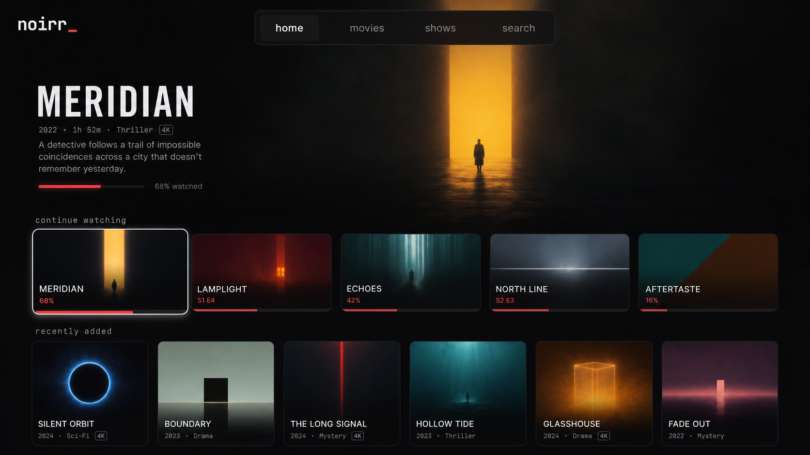

# Noirr — the media server and player

**Status:** visual direction to test · **Scope:** public presentation only ·
**Written:** 2026-07-30

Companion to [BRAND.md](BRAND.md), which preserves the earlier whole-suite
`noirr` concept, and [EXPLORATION.md](EXPLORATION.md), which explored a shared
replacement brand. This direction gives `noirr` one job: serving the library
and putting it on screen.

No repository, executable, API, bundle identifier, or compatibility surface is
renamed by this exploration.

## Brand architecture — three products, one sentence

| Product | Job | Naming status |
|---|---|---|
| `monarr` | Decides what is wanted and manages acquisition | Keep |
| Downloader | Transfers, repairs, extracts, and hands off | Name still open |
| `noirr` | Serves the library and plays it on every client | Test this direction |

**Shared line:** Everything between want and watch.

The line connects the products without making them look like editions of one
application. `noirr` should not gain an `*arr` sibling name, and its extra `r`
is a distinctive spelling rather than a suite-wide naming rule.

## The name — short, dark, and deliberately misspelled

- Write the product as **`noirr`**, lowercase, and pronounce it “nwar.”
- Use `noirr_` for the interactive wordmark. The cursor is a status detail,
  not part of the spoken name.
- Keep the product broader than the noir genre. The name describes the dark
  room and restrained interface; it does not constrain the library.
- Do not claim the spelling is collision-free. An unrelated clothing brand
  uses `noirr.com`, and musicians use the same name. Domain, store, package,
  and trademark clearance remain separate work.

The spelling creates friction: someone who hears the name cannot infer the
second `r`. The name earns that cost only if the visual identity stays strong
and the first-run, download, and documentation surfaces consistently show the
wordmark.

## Existing identity — keep the parts that already work

Use the existing [wordmark](wordmark.svg), [`n_` icon](icon-a-n-cursor.svg),
and [tokens](tokens.css) as the first production candidates.

| Element | Decision | Why |
|---|---|---|
| Wordmark | Lowercase `noirr_` | Compact and readable from a sofa |
| Icon | `n_` on midnight | Strong silhouette without a reel cliché |
| Accent | Crimson `#E5484D` | One signal for progress, focus, and status |
| Shell | Near-black · warm white | Artwork supplies the color |
| Type | Mono identity · sans content | Separates the system from the library |

The final `rr` stays typographic. Do not force it into a rewind,
fast-forward, or film-reel symbol; that makes the unusual spelling feel like
a gimmick.

## Television layout — content first, administration elsewhere

The generated screen is a layout study, not implementation artwork. Every
title and image is fictional. Its useful decisions are:

- Keep one quiet navigation row: `home` · `movies` · `shows` · `search`.
- Let the focused title own the upper half of the screen. Description and
  progress are readable without turning the page into a detail dashboard.
- Show focus with scale, outline, and depth together. Crimson remains progress
  and status; focus cannot depend on color alone.
- Use landscape cards for in-progress items and posters for browsing. Their
  different shapes explain their jobs before the labels do.
- Remove scan state, accounts, sign-out, server health, and queue controls from
  the television home screen. Those belong in the web administration surface.
- Drop playback to true black. The brand never tints the picture.

The study intentionally preserves the existing mono identity while reducing
terminal-dashboard density. A media player can expose technical truth without
making every viewing surface look operational.

## Voice — quiet enough to disappear

`noirr` copy is lowercase, terse, and literal. Personality belongs in empty
states, not primary controls or errors.

| Surface | Copy |
|---|---|
| Home | `everything between want and watch` |
| Empty library | `nothing here yet` |
| Resume | `continue watching` |
| Missing file | `the file is no longer available` |
| Failed playback | `this version cannot play on this device` |

Errors name what failed and the next useful action. Noir flavor never replaces
an explanation.

## This round does not decide the rename

- The current `plurx` identifiers remain unchanged because public naming and
  compatibility contracts have different migration costs.
- The downloader still needs its own name; `Winch` remains a candidate, not a
  decision.
- The three products do not need a fictional media-company name to share a
  sentence and a small set of design rules.
- Generated imagery is not a source asset. Production UI and icons remain
  deterministic code and SVG.

Advance `noirr` only after the spelling survives speech, package names, an App
Store listing, and a trademark screen. The visual direction has passed; the
name still has operational work to do.
