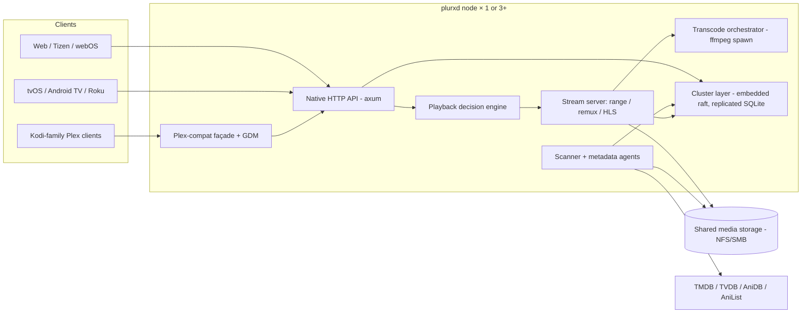

# plurx — Server Architecture

One Rust binary, `plurxd`. Run one for a normal server; run three and they form an active-active HA cluster. This document describes the internals and records the founding technical decisions with rationale. Ecosystem facts and version numbers were verified 2026-07.

## 1. System overview

Every node is identical — there are no roles to configure. The raft leader is an internal detail (it serializes writes); all nodes serve reads, streams, and transcodes.

## 2. Cluster & state (the differentiator)

Nobody in this space has HA: Jellyfin is architecturally single-instance (SQLite single-writer, in-memory transcode sessions — its own community bolts on keepalived + rsync and calls it a day), and no Rust media server is both maintained and clustered. The specific hard problem worth solving is **replicated playback/transcode session state** — the thing that makes failover invisible instead of "my movie died, restart it."

### 2.1 Consensus & storage

**Primary plan: embed [hiqlite](https://github.com/sebadob/hiqlite)** — raft-replicated SQLite built on openraft, purpose-built for the exact "1 node or 3+ nodes, no external infra" shape (production-proven as Rauthy's default store; SQL + replicated KV cache + distributed locks + listen/notify in ~65 MB RAM for an HA cluster). **Fallback plan** if hiqlite doesn't fit after a spike: hand-rolled [openraft 0.9.x](https://github.com/databendlabs/openraft) with a redb raft log and a rusqlite state machine — the same architecture, more plumbing owned by us. The spike in Phase 3 decides; nothing before Phase 3 depends on the choice because all cluster access goes through one internal `Store` trait.

Single-node mode is the same code path with a 1-voter raft (a supported openraft/hiqlite pattern) — no "cluster edition" divergence, and any single node can later grow into a cluster by adding voters.

### 2.2 Replication classes

| Class | Examples | Storage | Loss tolerance |
|---|---|---|---|
| **Replicated-durable** | Users, auth tokens, settings, library metadata, watch state, playlists | Raft → SQLite | None once acked |
| **Replicated-ephemeral** | Playback sessions (item, decision, position, segment index), node membership/health | Raft KV/cache with TTL | Seconds of staleness OK |
| **Node-local, regenerable** | Transcode segment cache, image cache, thumbnails/trickplay | Local disk (optionally shared) | Free to lose |
| **Operator-owned** | The media files themselves | Shared storage (NFS/SMB/cephfs) | plurx never writes media |

Write rates are safe for raft: watch-state progress ticks batch to ~1 write / 10 s / stream server-side regardless of client ping rate; session state updates on segment boundaries, not per-chunk.

### 2.3 The failover mechanic

Deterministic segmentation makes active-active transcoding possible without shared scratch:

1. Every transcode session pins its full recipe in replicated state: source file, ffmpeg arg hash, segment duration `d` (e.g. 4 s), forced keyframes at exact multiples of `d`.
2. Segment `N` is therefore a pure function of (recipe, N) — **any node can regenerate any segment** by launching ffmpeg with a seek to `N·d`.
3. HLS playlists are generated (not stored), identical on every node.
4. Client-side failover: clients hold the node list (REQ-HA-6); on request failure they retry the same URL against the next node. The new node finds the session in replicated state, spawns ffmpeg at the right offset, serves the segment. Cost: a few seconds of buffering. Direct play and remux failover are the same minus ffmpeg (stateless range requests / deterministic remux).
5. ffmpeg always runs as a child process — a codec crash kills a session, never a raft voter (process isolation is load-bearing for HA).

Scanner and metadata-refresh jobs are leader-scheduled singletons (distributed lock), so three nodes don't triple-hit TMDB or thrash shared storage.

## 3. Playback pipeline

**Decision engine** — pure function: `(file streams+HDR/audio detail, device profile, client-reported caps, user prefs, bandwidth) → Decision{DirectPlay | Remux{...} | Transcode{...}}`. Device profiles are data files (TOML) shipped with the server and hot-fixable; the file-side facts come from the scanner (§4). Exposed through both the native API and the Plex-compat `/decision` endpoint.

**Serve paths:**

- *Direct play* — HTTP range serving of the file with correct caching headers; zero CPU.
- *Remux* — on-the-fly restream (MKV → fMP4/HLS) with `-c copy`; solves "right codecs, wrong container" (the tvOS/Roku staple) for pennies of CPU.
- *Transcode* — hardware first: QSV / VA-API (Linux), NVENC, VideoToolbox (macOS); software x264/x265 fallback. HDR→SDR tone mapping via `libplacebo` (Vulkan, `tonemapping=bt.2390`) as the cross-vendor path, with vendor filters (`tonemap_opencl`, `vpp_qsv`, `tonemap_videotoolbox`) as alternates — mirroring Jellyfin's proven matrix. Image subs and (later) ASS burn-in happen here.
- *Audio* — passthrough policy per device profile (TrueHD/DTS-HD where the chain allows), else transcode to EAC3/AC3/AAC with correct downmix.

ffmpeg is orchestrated as a **spawned CLI** (via `ffmpeg-sidecar` or thin tokio process code), never linked: crash isolation, license cleanliness, and drop-in support for the user's ffmpeg build — **jellyfin-ffmpeg explicitly supported** as the recommended binary for its extra hwaccel/tone-mapping patches.

## 4. Scanner & metadata

- Identify: filename/structure parsers (movie, show, anime naming conventions).
- Inspect: `ffprobe -print_format json` as ground truth (codecs, profiles, bit depth, HDR10/HDR10+/DV profile & level, audio layouts, subs); fast pure-Rust pre-scan (`matroska`, `symphonia`) to cheaply skip unchanged files. Results feed the decision engine verbatim.
- Match: provider agents for TMDB (primary), TVDB, AniDB/AniList (anime ordering rules, absolute numbering, title variants). Anime detection routes items to anime-correct ordering rather than forcing TVDB season shapes.
- Cache: all provider responses and artwork cached in replicated metadata / shared artwork cache; a scanned library works offline forever (REQ-META-4).
- Watch: inotify on library roots + periodic reconcile; incremental and resumable; leader-coordinated.

## 5. API design

**Native API** (`/api/v1`) — JSON over HTTP, OpenAPI-specified from day one (clients across 5 platforms need generated types), WebSocket for push (now-playing, scan progress, cluster events). Auth: opaque bearer tokens from local login; optional OIDC (Google/Apple) code flow mapping to local accounts (REQ-USER-2). Argon2id at rest.

**Plex-compat façade** (Tier 1, REQ-PLEX-1) — a stateless translation layer over the same services, plus a GDM responder (UDP 239.0.0.250:32414, LAN-only). Implements the endpoint set the Kodi-family clients use: `/identity`, `/library/sections...`, `/library/metadata/...`, `/photo/:/transcode`, part serving, `/video/:/transcode/universal/decision|start.m3u8`, `/:/timeline`, `/:/scrobble`, `/:/progress`, `/hubs/search`, `/playlists`. XML `MediaContainer` by default, JSON on `Accept: application/json`; `X-Plex-Token` values are plurx tokens. Behavioral references: official developer.plex.tv docs (public since 2025), python-plexapi, and the Composite/PKC sources. plex.tv is never contacted (REQ-PLEX-3); plex.tv *emulation* for Infuse/official apps is deferred Tier 2 (see CLIENTS.md §3).

## 6. Tech stack (verified 2026-07)

| Concern | Choice | Notes |
|---|---|---|
| Language | Rust (stable) | Single static binary; cross-compile amd64/arm64 |
| HTTP | axum 0.8 + tower-http (+ axum-range) | Streaming bodies, range serving; hyper 1.x |
| Cluster | hiqlite 0.14 (spike) → else openraft 0.9 + redb + rusqlite | §2.1 |
| Local DB | SQLite (rusqlite) + FTS5 search | Relational metadata, migrations |
| Transcode | ffmpeg CLI spawn (`ffmpeg-sidecar`); jellyfin-ffmpeg supported | §3 |
| Inspection | ffprobe JSON (`ffprobe` crate); `symphonia` 0.6 / `matroska` pre-scan | §4 |
| HLS/DASH | `m3u8-rs` / `hls_m3u8`; generated playlists | §2.3 |
| Discovery | mDNS `_plurx._tcp` + Plex GDM responder | LAN only |
| Observability | `tracing` + Prometheus exporter | REQ-OPS-1 |
| Avoided | sled (stalled), rocksdb (C++ dep), external DBs, ffmpeg linking | — |

## 7. Risks & mitigations

| Risk | Mitigation |
|---|---|
| hiqlite is a small project (bus factor) | `Store` trait isolation; openraft fallback is the same shape; both MIT/Apache |
| Deterministic-segment failover has sharp edges (VFR sources, keyframe drift) | Spike early (Phase 3 gate); worst-case fallback = session restart-at-position, still beating everyone |
| Plex-compat drift / client quirks | Tier 1 targets a small, testable client set; contract tests against recorded Composite/PKC traffic; official API docs exist now |
| DV/HDR correctness is genuinely hard | Treat profiles as data; test files corpus per DV profile (P5/P8) from day one; HDR10 base-layer + tone-map fallbacks |
| Solo-dev scope creep | Roadmap phases are gates; anything not in REQUIREMENTS.md is a "later" by default |
