# UI layouts & themes — design proposals for review

**Status:** proposals, nothing implemented · **Decides:** a layout system,
four new layouts, five new themes · **Written:** 2026-08-02 · **Companion
mockups:** [`docs/mockups/`](mockups/index.html)

This document proposes a *layout system* for every plurx surface — the web
app and the Android / iOS / iPadOS / Apple TV / Google TV clients — plus a
set of new themes. It exists to be reviewed: §8 is the checklist of
decisions the review needs to make. After review, the accepted subset gets
distilled into a build plan and handed to the implementing agent; §6 is a
draft of that plan so the review can also judge cost. Nothing in this
document changes the server API, the playback pipeline, or any URL.

How to review: open [`docs/mockups/index.html`](mockups/index.html) in a
browser (plain files, no server, no network) and click through layouts ×
themes × screens. The stills embedded below are exports from those same
pages. Every title, poster, and file name in the mockups is fictional —
same convention as the `docs/img/` screenshots.

---

## 1. The shape of the proposal — layouts × themes, orthogonal

**A layout is structure. A theme is paint.** A layout decides where
navigation lives, how dense a screen is, and which chrome exists at all; a
theme remaps the color/typography tokens and never moves anything. Keeping
the two orthogonal means every theme works on every layout — the existing
CSS-variable system already guarantees this, because components only ever
read tokens (`--bg`, `--accent`, …) and layouts only add *structure*.

Each layout names a **signature theme** — the default it selects the first
time a user picks that layout (their explicit theme choice always wins,
and is kept per layout so switching back restores it):

| Layout | One sentence | Signature theme | Status |
|---|---|---|---|
| `classic` | The current app, unchanged, now with a name | noirr | shipped today, becomes "classic" |
| `plex` | Old-Plex sidebar shell: pinned libraries, hub rows, poster grids | Amber (new) | proposed |
| `theater` | Full-bleed cinematic hero, chrome that gets out of the way | noirr | proposed |
| `deck` | Dense operator view: tables, always-on filters, status footer | Terminal | proposed |
| `guide` | The library as a retro channel guide; replaces Home only | VHS (new) | proposed |

Themes: the three shipped themes (**Classic**, **Terminal**, **noirr**)
are untouched. Five proposed additions: **Amber**, **Giallo**, **Silver**,
**Void**, **VHS** (§4). Giallo and Silver fill the two slots
[BRAND.md](../brand/BRAND.md) has reserved since the kit was drawn
("giallo / silver — someday").

The mockups, one file per surface class:

| File | Shows |
|---|---|
| [`mockups/web.html`](mockups/web.html) | all five web layouts × 8 themes × dark/light × home/library/detail |
| [`mockups/tv.html`](mockups/tv.html) | 10-foot shells in a 16:9 frame; arrow keys move the focus ring |
| [`mockups/mobile.html`](mockups/mobile.html) | all five layouts as phones + the tablet/iPadOS sidebar variant |
| [`mockups/themes.html`](mockups/themes.html) | the 8-theme sheet with component samples, dark & light |

---

## 2. The layout system — the contract

### 2.1 What a layout may and may not touch

A layout owns: the app chrome (headers, sidebars, tab bars, footers), the
composition of each view (rails vs grids vs tables), card shapes and
labels, and which secondary affordances are visible where. A layout does
**not** touch: the data layer and API calls, the hash-route scheme
(`#/item/…`, `#/library/…`, `#/activity`, `#/settings` stay universal),
the player (projection mode — playback drops to true black in every
layout and every theme), auth screens, the settings *forms* (only their
framing), and user-facing strings (everything renders `${APP_NAME}`,
today `"cinemarr"` — [index.html:828], never the literal "plurx").

Why the hard line: five layouts that each fork business logic are five
apps. Five shells over one set of view-models is one app wearing five
jackets — that is the only version a solo maintainer should ship.

### 2.2 Selection and persistence — mirror the theme system

The shipped theme machinery ([index.html:835–891] — `THEMES`,
`applyTheme()`, `localStorage.plurx_theme` / `plurx_appearance`,
`data-theme` + `data-mode` on `<html>`; re-verify line numbers at build
time) is the template. Layouts get the identical treatment:

```
LAYOUTS = { classic: {...}, plex: {...}, theater: {...}, deck: {...}, guide: {...} }
localStorage.plurx_layout   → "classic" when absent or unknown (safe default)
<html data-layout="plex">   → structural CSS scopes under [data-layout=…]
menu: the appearance popover grows a "layout" section above "theme"
```

Per-device by design, like themes: the TV in the living room can run
`theater` while the office browser runs `deck`, against the same server.
No server-side persistence in v1 — `localStorage` is already the
precedent and it keeps M1 a pure-client change.

### 2.3 The theme contract (tokens)

Every theme supplies exactly this set (the shipped contract, unchanged):

```
--bg --panel --panel2 --line --text --muted --accent --accent2
--good --bad --warn --radius --btn-ink --prose --font --font-mono
optional: --glow --shadow --grain     (noirr today; Giallo/VHS tomorrow)
new optional flag: darkOnly           (Void, VHS — see §4)
```

`darkOnly` behavior: when appearance resolves to light, a dark-only theme
stays dark and the appearance menu says so inline ("Void is a
midnight-only theme") instead of silently ignoring the toggle. Rejected
alternative — falling back to Classic-light — swaps the whole personality
of the UI on a toggle that claims to change brightness; surprising, so no.

**The rule that keeps every theme honest:** structural UI colors must be
token-mixed (`color-mix(in srgb, var(--accent) 15%, var(--panel))`),
never hardcoded hex. The scar: hardcoded dark hexes rendered as black
boxes on the light themes, caught only by screenshotting
(2026-07-22, recorded in project memory). The mockups obey this rule —
that is why one stylesheet survives 8 themes × 2 modes.

### 2.4 Where layouts live in the web code

The SPA is one embedded file (`crates/plurxd/src/web/index.html`,
`include_str!` — UI edits require `cargo build` + restart). The `render()`
hash-router ([index.html:6040]) stays; what changes is that chrome and
view bodies route through the active layout:

```
render() ── route ──▶ view*(…)                      (data fetch, unchanged)
                        │
                        ▼
              LAYOUTS[cur].chrome(activeNav, body)   (shell per layout)
              LAYOUTS[cur].views.{home,library,detail,…} (only where structure
                                                          differs; else shared)
```

Estimated renderer matrix — "shared" means the existing renderer with
layout-scoped CSS; "own" means a layout-specific body builder:

| View | classic | plex | theater | deck | guide |
|---|---|---|---|---|---|
| chrome (header/side/tabs) | shared (today's) | own | own | own | classic's |
| home | shared | own (hubs) | own (hero) | own (tiles+tables) | own (the guide) |
| library | shared | own (tabs+scrubber) | CSS + chip bar | own (table mode) | classic's |
| item detail | shared | own (backdrop hero) | own (full-bleed) | own (spec sheet) | classic's |
| activity / settings / auth | shared | shared | shared | shared (deck-framed) | shared |
| player | shared everywhere — projection mode is not negotiable |||||

Poster cards, rails, badge pills, and progress bars stay single
implementations parameterized by CSS (`--w`, label visibility) — the
mockups already demonstrate one card component surviving all five
layouts.

### 2.5 The native clients

Per [CLIENTS.md](CLIENTS.md): one TypeScript web core (browser + future
Tizen/webOS), Kotlin/Compose for Android + Google TV, SwiftUI for
iOS/iPadOS/tvOS. The Android client already ships "three web-matched
themes" — the theme catalogue extends to eight by porting token values
into each platform's scheme type (Compose `ColorScheme`, SwiftUI
environment). Layouts map to navigation scaffolds, not shared code:

| Layout | Phone (Compose/SwiftUI) | Tablet / iPadOS | TV (tvOS / Android TV) |
|---|---|---|---|
| classic | top bar + stacked rails (today's clients) | same, wider grids | web-app-style top nav (today) |
| plex | bottom tab bar (Home · Libraries · Search · Activity) | sidebar returns (desktop-class) | collapsed icon rail, expands on focus |
| theater | full-bleed hero + floating pill nav | hero + rails | quiet top nav row, hero owns upper half |
| deck | dense list + filter chips + status strip | two-pane list/detail | not offered on TV — falls back to classic |
| guide | vertical channel list (now/next) | guide grid | full-screen guide grid (the natural home) |

The theater TV row adopts the decisions already recorded in
[brand/NOIRR_PLAYER.md](../brand/NOIRR_PLAYER.md): one quiet nav row,
focused title owns the upper half, landscape cards for in-progress /
posters for browsing, no admin surfaces on the television, playback in
true black. TV focus is always scale + ring + depth together — never
color alone — so every theme (including Silver) keeps focus visible.

---

## 3. The layouts

### 3.1 `classic` — the current app, named and frozen

**What it is:** exactly what ships today: sticky top bar (wordmark ·
Home/Activity/Settings · scan pill · search · user · appearance · sign
out), centered 1400px content, hub rails (continue watching / next up /
recently added), poster grids per library, poster-left detail pages with
version cards. Becoming a *named* layout costs nothing visually — it is
the zero-diff baseline the other four are judged against, and the
guaranteed fallback (`plurx_layout` absent or unknown → classic).

**Naming note:** there is already a *theme* named Classic. A layout and a
theme sharing the word is livable (they sit in separately-labeled menu
sections) but slightly awkward — §8 offers a rename slot if it grates.

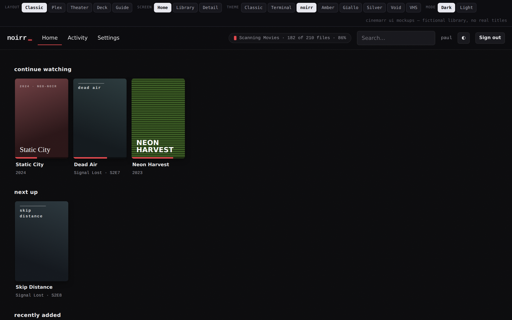
*classic × noirr — the app as it ships today, now answering to a name.*

### 3.2 `plex` — the sidebar shell (the one you asked for by name)

**What it is:** the Plex Web shell plurx users already have in their
muscle memory — a fixed left sidebar (wordmark, search, Home, pinned
libraries with icons and counts, Activity/Settings under a "manage"
divider, scan status + user chip pinned at the bottom), hub rows on
Home, toolbar-plus-grid libraries, and backdrop-hero detail pages.

**Fidelity to Plex — what we copy, and from which Plex.** Plex is
mid-transition: the 2018-era web app (left sidebar, hubs, A–Z scrubber)
and the 2024–26 "new Plex experience" rewrite (bottom tabs on mobile
since 2025-03; TV apps that briefly moved navigation to top tabs, got the
backlash, and were remastered back toward a rail; studio title art and
color-matched gradients on detail pages). This layout copies the *web
sidebar* school on desktop — that is "the current plex layout" as lived
daily — and steals the new experience's three best ideas where they fit:

- **Detail pages are art-forward:** full-width backdrop under a scrim,
  poster + oversized title, metadata as pills, amber Play lockup.
- **Mobile gets bottom tabs** (Home · Libraries · Search · Activity),
  because a sidebar on a phone is a hamburger with extra steps.
- **TV gets a collapsed icon rail** that expands on focus — both the old
  Plex TV pattern and where the remaster landed after top-tabs failed.

Plex vocabulary deliberately kept: the **unwatched corner flag** (accent
triangle, top-right of the poster), hover play circle on cards, hub row
titles with "see all", the library **A–Z scrubber** on the right edge,
`Library / Collections / Categories` tabs. Plex vocabulary deliberately
**not** copied: anything that exists because plex.tv exists — Discover /
streaming-service rows, watchlist-first navigation, account upsell chrome.
plurx has no cloud, so the sidebar lists *your libraries* and nothing
else. That is the old-Plex ethos this project was founded on.

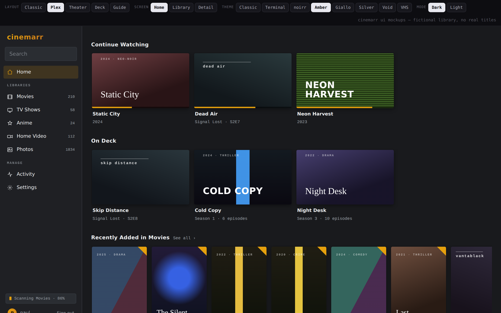
*plex × Amber — sidebar, hub rows, corner flags, hover play.*

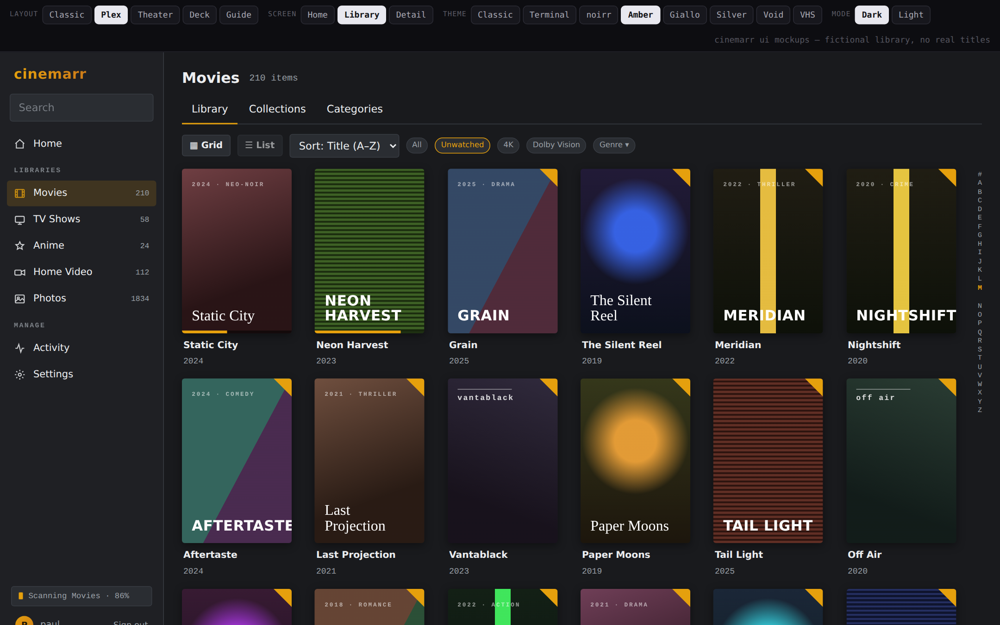
*Library browse: view toggle, sort, filter pills, A–Z scrubber.*

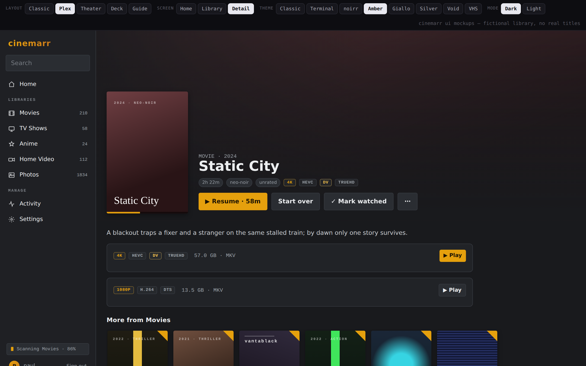
*Detail: backdrop hero + poster + pills; version cards keep plurx's
tech-honest file rows.*

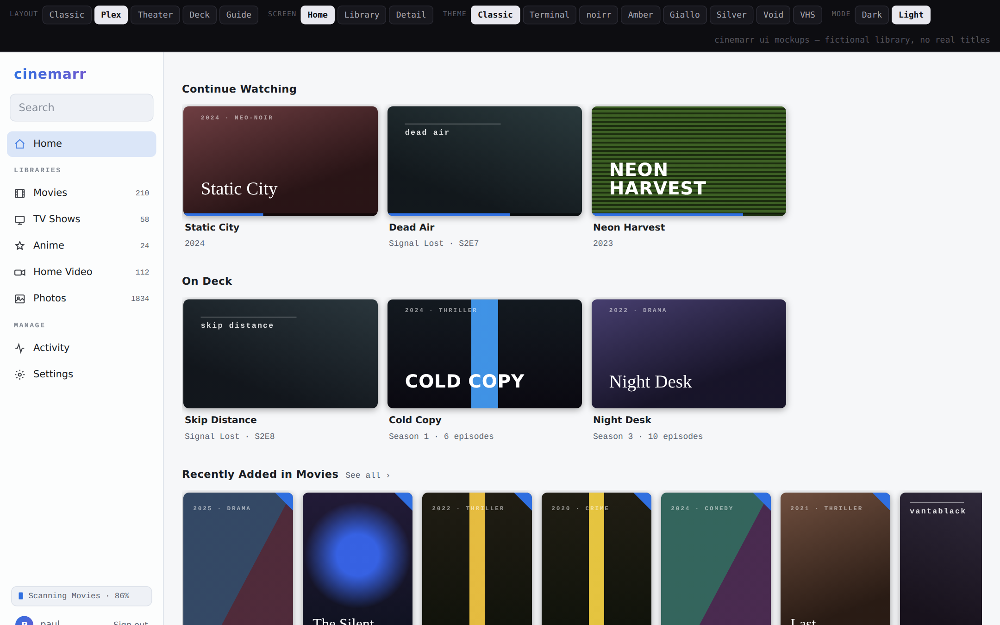
*Orthogonality check: the same plex layout wearing Classic-light.*

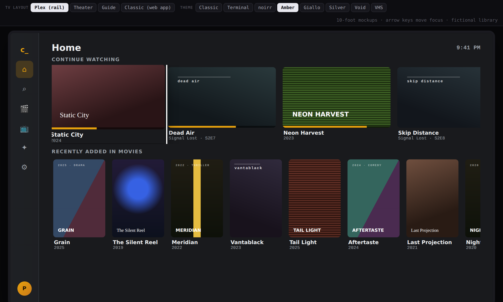
*10-foot: icon rail (expands on focus), landscape continue row, poster
rail. Clock top-right, no admin anywhere.*

### 3.3 `theater` — lean-back cinema, chrome optional

**What it is:** the Netflix/Apple-TV+ school tuned to a private library:
a full-bleed hero (your actual continue-watching item, not a promo), a
translucent top bar that fades over art, uppercase micro-labels on rails,
larger posters, captions that appear on hover. Libraries become an
immersive grid under a floating filter-chip bar; detail pages are
full-screen backdrops with the facts in the lower third. Density is
sacrificed on purpose — this is the sofa layout, and on TV it is the
flagship (per-platform rows in §2.5). Home video and photo libraries
still render as folders/grids — the hero only ever features playable
video items.

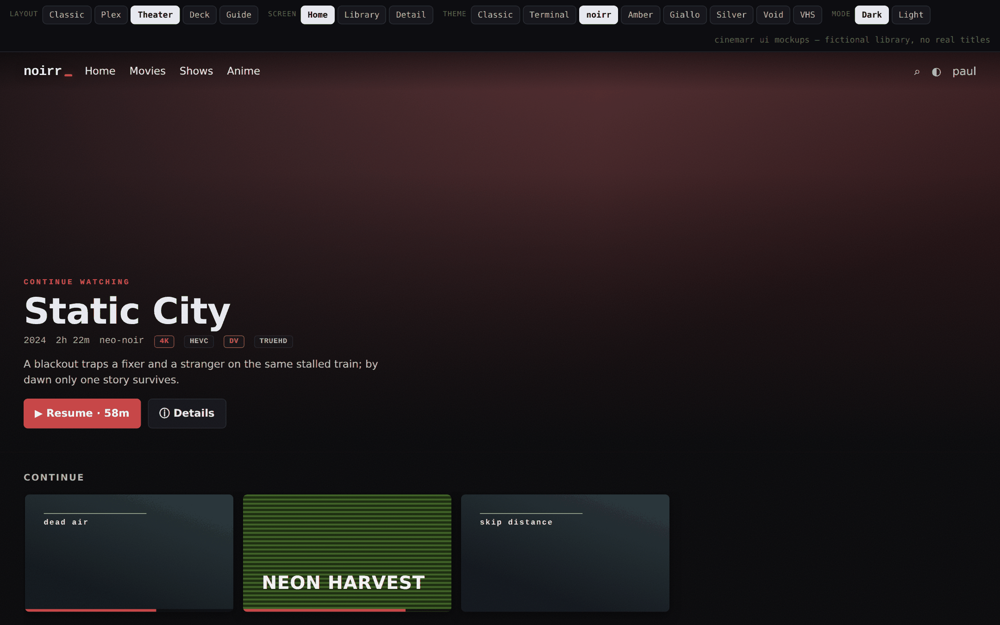
*theater × noirr — the hero is your half-watched film, not an ad.*

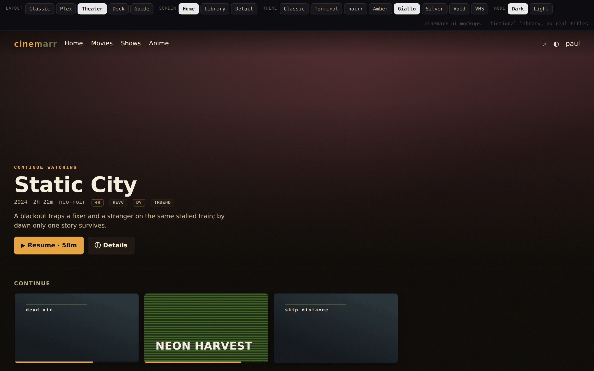
*Same structure in Giallo — amber heat, grain a notch louder.*

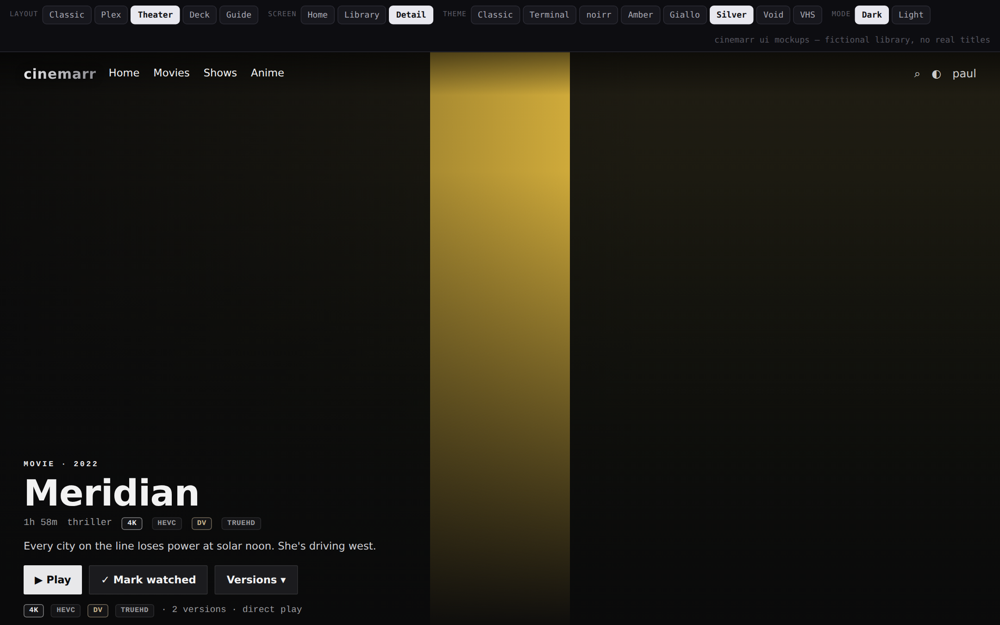
*Detail in Silver: full-bleed, facts in the lower third, versions
collapsed behind one control.*

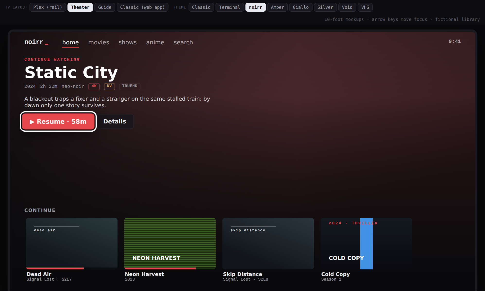
*The TV expression follows brand/NOIRR_PLAYER.md: quiet nav row, focused
title owns the upper half.*

### 3.4 `deck` — the operator's console

**What it is:** the collector/operator view the *arr world trains you to
want: a mono-typography shell with a compact left rail (library tree with
counts), a toolbar whose filters are always visible (unwatched · 4k · dv
· hevc · + filter), **table mode as a first-class library view** (title /
year / res / video / hdr / audio / size / added / watched — sortable),
grid mode one toggle away, and a home screen of stat tiles + dense
continue/recent tables. Item pages are spec sheets: file table, stream
details, watch history, admin actions (reanalyze · edit) at arm's reach.

**The status footer is the point.** A persistent bottom strip shows scan
progress, active sessions with their play method (direct / remux /
transcode), disk, and uptime — always visible, on every deck screen. This
is the design answer to a standing requirement: anything that uses real
hardware must be attributable from inside the product (the GPU-pinning
background producer of 2026-07-29 is the scar). Deck makes attribution
ambient; the other layouts keep the scan pill and the Activity page.
Keyboard-first: `/` search, `j/k` move, `enter` open, `w` toggle watched.

Deck is a web/desktop/tablet layout. It is deliberately **not offered on
TV** (a data table at 3 meters is a punishment), and on phones it becomes
a dense list with the status strip intact.

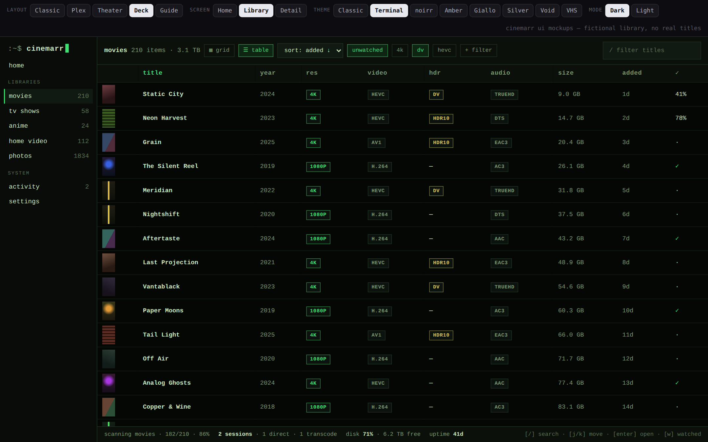
*deck × Terminal — the natural pairing. Table mode, always-on filters,
status footer.*

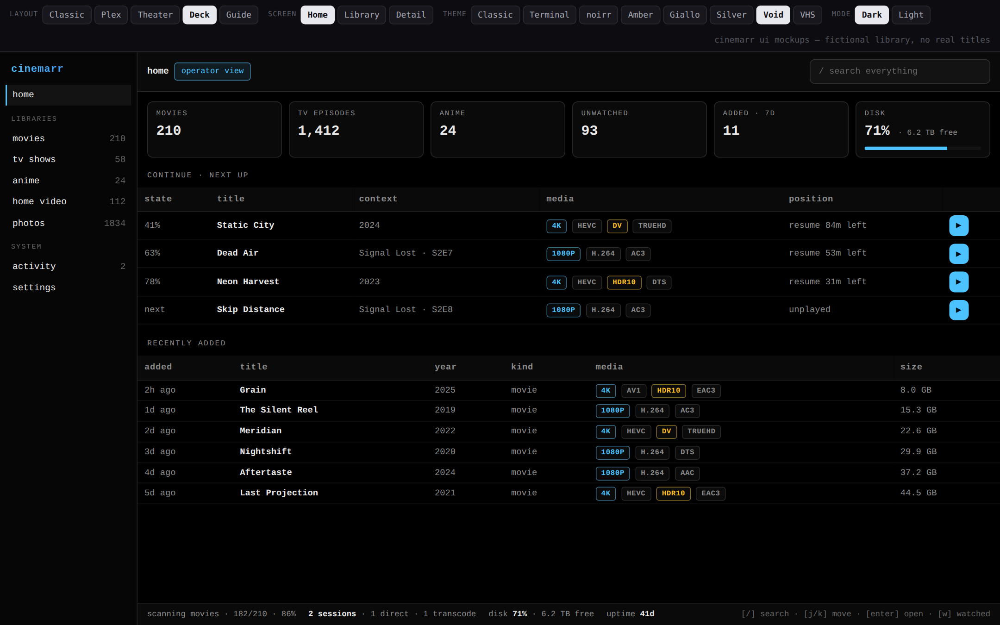
*deck home in Void: stat tiles, dense continue/recent tables. True-black
friendly.*

### 3.5 `guide` — the library as a broadcast day (the wildcard)

**What it is:** Home replaced by a retro channel guide. A preview panel
up top (the highlighted item as a "now showing" screen with scanline
texture), a time ruler (NOW · +30 · +60 · +90), and numbered channels
whose cells are sized by runtime remaining. Channels are *generated
programming*, not saved playlists:

| Channel | Fed by (all existing data — no new server API) |
|---|---|
| CONTINUE | the continue-watching hub, cells sized by time remaining |
| MOVIES · <genre> | a rotating genre slice of the movie library |
| <show name> | next-up marathon for the show you're deepest into |
| RECENTLY ADDED | the recently-added hub |
| ANIME / HOME VIDEO | per-library rows, present only if the library is |
| SHUFFLE | uniform random over the whole catalogue |

Selection rules are deterministic per day (seeded by date) so the guide
feels like a schedule, not a slot machine; `enter` on any cell just plays
the item. **Scope honesty:** guide replaces *Home only*. Browse, detail,
activity, and settings use the classic shells with a small "guide" chip
(the mockup shows this) — a channel grid is a discovery surface, not an
information architecture. On TV it is gloriously at home (number keys
jump channels, color buttons for details/watch/shuffle); on phones it
becomes a vertical now/next channel list.

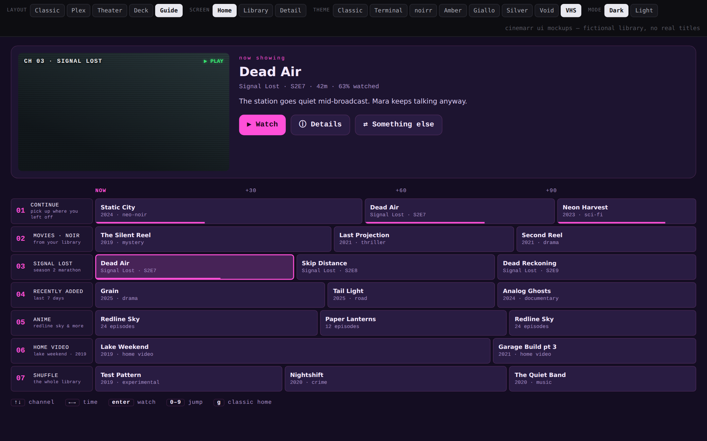
*guide × VHS — the pairing that sells it. Progress underlines on
partially-watched cells; one cell focused.*

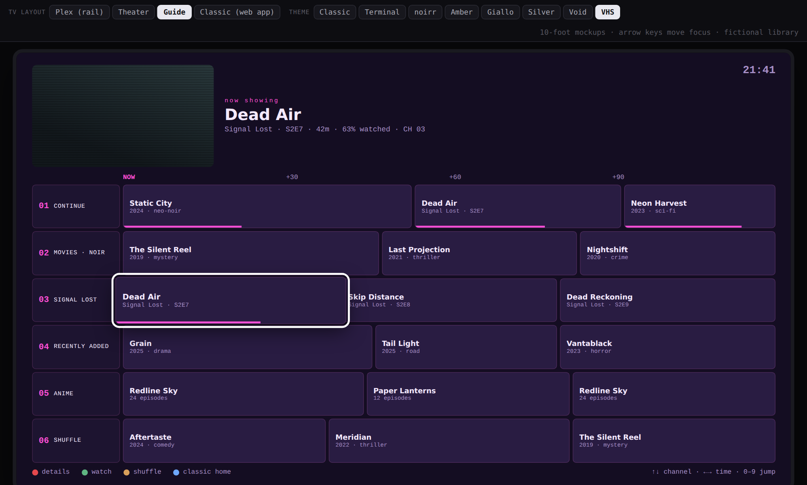
*The TV guide: D-pad native, color-button shortcuts, number-key channel
entry.*

---

## 4. The themes

### 4.1 Naming

The gold theme is named **Amber**, not "Plex": the layout already spends
that word (`plex` as a layout name is an in-joke that reads fine in a
private app), and two pickers both saying "Plex" would make "plex layout
+ Amber theme" impossible to say out loud. §8 has the override box if
you want the joke twice.

### 4.2 Token sets (the contract values)

Exact values as mocked; these are the values the implementation should
ship unless review amends them. Dark rows first, light rows where the
theme has a light showtime. (Classic / Terminal / noirr are shipped and
unchanged — their tokens live in [index.html:835–853].)

**Amber — charcoal + gold. Signature of `plex`.**

| token | dark | light |
|---|---|---|
| bg / panel / panel2 | `#191a1d` / `#212327` / `#2a2d32` | `#f3f4f6` / `#ffffff` / `#e9ebee` |
| line | `#383c43` | `#d5d9de` |
| text / muted / prose | `#eceef0` / `#9aa0a7` / `#c9cdd2` | `#1e2124` / `#5f666d` / `#3a4046` |
| accent / accent2 | `#e5a00d` / `#cc7b19` | `#c8880a` / `#a95f16` |
| good / bad / warn | `#52b788` / `#e5534b` / `#f2c14e` | `#238a5e` / `#c93f38` / `#8a6116` |
| radius / btn-ink | `8px` / `#1c1303` | `8px` / `#ffffff` |

Note: warn sits near accent by design (gold house); status pills always
carry a word, never color alone, so the adjacency is safe.

**Giallo — the kit's reserved amber showtime. noirr's structure, amber
heat, grain a notch louder (0.055 / 0.035). Crimson is *correct* as the
error color here — giallo posters are yellow and red.**

| token | dark («mezzanotte») | light («giorno») |
|---|---|---|
| bg / panel / panel2 | `#0c0a06` / `#14100a` / `#1c160d` | `#f5eed9` / `#fbf7ea` / `#ffffff` |
| line | `rgba(240,200,120,.10)` | `rgba(90,70,30,.14)` |
| text / muted / prose | `#f2e9d8` / `#a89c85` / `#d6ccb8` | `#241d10` / `#6e6350` / `#4a4233` |
| accent / accent2 / glow | `#e8a33d` / `#8a5a14` / `rgba(232,163,61,.30)` | `#a8720c` / `#7c4a05` / `rgba(168,114,12,.14)` |
| good / bad / warn | `#5fb582` / `#e5484d` / `#c9723a` | `#35855c` / `#b23a35` / `#8a6116` |
| radius / btn-ink | `10px` / `#1a1002` | `10px` / `#ffffff` |

**Silver — the kit's reserved B&W showtime. White is the accent at
night; ink is the accent by day. Status colors stay *quietly tinted*
(desaturated green/amber/rust) rather than pure grayscale — a fully
monochrome "failed" is an accessibility lie. §8 asks you to confirm this
choice.**

| token | dark («silver screen») | light («matinee silver») |
|---|---|---|
| bg / panel / panel2 | `#0a0a0b` / `#131315` / `#1b1b1e` | `#f4f4f2` / `#ffffff` / `#eaeae7` |
| line | `rgba(255,255,255,.10)` | `rgba(20,20,20,.14)` |
| text / muted / prose | `#f2f2f2` / `#9a9a9e` / `#cfcfd3` | `#141416` / `#66666a` / `#3a3a3e` |
| accent / accent2 | `#e8e8ea` / `#8a8a8f` | `#1a1a1c` / `#5a5a5f` |
| good / bad / warn | `#9fbfa8` / `#d09088` / `#c9b48c` | `#4a7a58` / `#a05248` / `#8a7442` |
| radius / btn-ink | `6px` / `#0a0a0b` | `6px` / `#ffffff` |

**Void — true black for OLED. Dark-only (`darkOnly: true`). Borders do
the structural work (`--shadow: none`); electric ice-blue accent so the
single color reads at minimum brightness.**

| token | dark |
|---|---|
| bg / panel / panel2 | `#000000` / `#0a0a0a` / `#131313` |
| line | `rgba(255,255,255,.13)` |
| text / muted / prose | `#e8e8e8` / `#8a8a8a` / `#c6c6c6` |
| accent / accent2 | `#4cc2ff` / `#2f6fe0` |
| good / bad / warn | `#34d399` / `#f87171` / `#fbbf24` |
| radius / btn-ink | `12px` / `#001018` |

**VHS — tracking-line synthwave. Dark-only. Magenta accent, cyan
accent2 (the one theme whose logo gradient runs magenta→cyan), chromatic
double-shadow on the wordmark, and the loading language upgrades from
scanlines to chunky tracking bars.**

| token | dark |
|---|---|
| bg / panel / panel2 | `#140d22` / `#1d1430` / `#291c42` |
| line | `rgba(255,120,220,.16)` |
| text / muted / prose | `#f4e9ff` / `#a78fc7` / `#d9c9ee` |
| accent / accent2 / glow | `#ff4fd8` / `#26e2ff` / `rgba(255,79,216,.35)` |
| good / bad / warn | `#3ddc97` / `#ff5c7a` / `#ffb454` |
| radius / btn-ink | `14px` / `#22041c` |

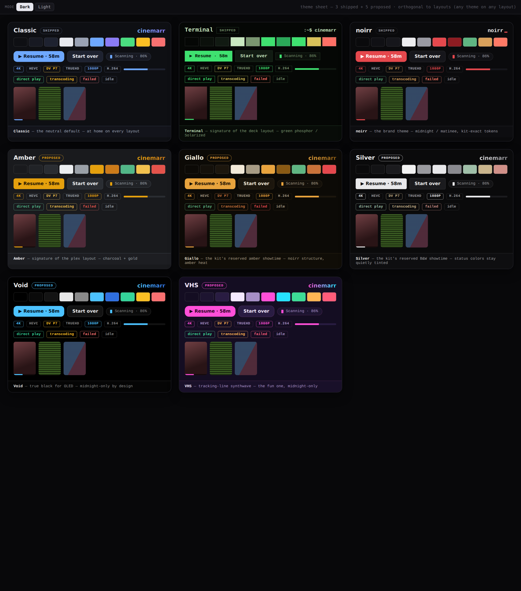
*The eight-theme sheet, dark showtimes.*

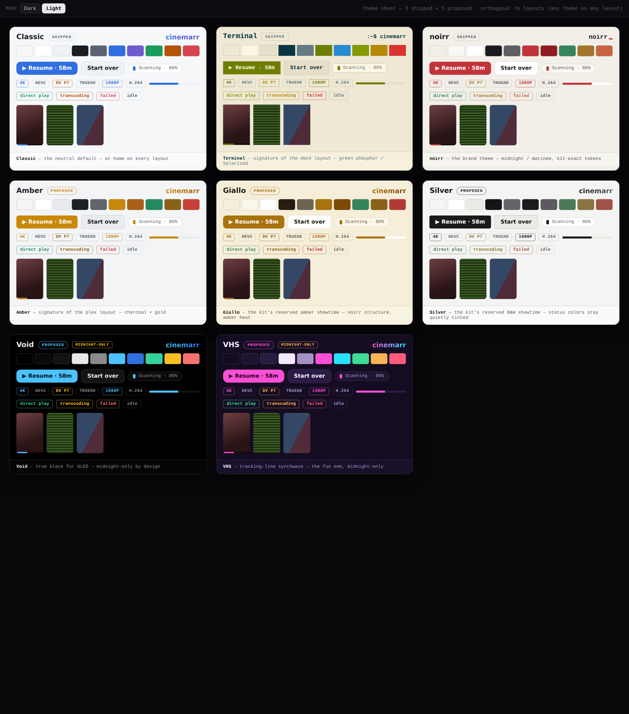
*Light showtimes; Void and VHS pin to midnight and say so.*

### 4.3 Rules that apply to every theme

1. **Token-mixed structural colors only** (§2.3) — the light-mode
   black-box scar is not getting a sequel.
2. **Posters carry the color; chrome stays quiet.** Kit principle, and
   the reason one fictional poster set survives all eight themes.
3. **Playback is always midnight.** Projection mode overrides every
   theme; the brand never tints the picture.
4. **Focus/status never depend on color alone** — words on status pills,
   scale+ring+depth on TV focus. Silver is the theme that enforces this
   discipline on everything else.

---

## 5. Phones and tablets, in one picture

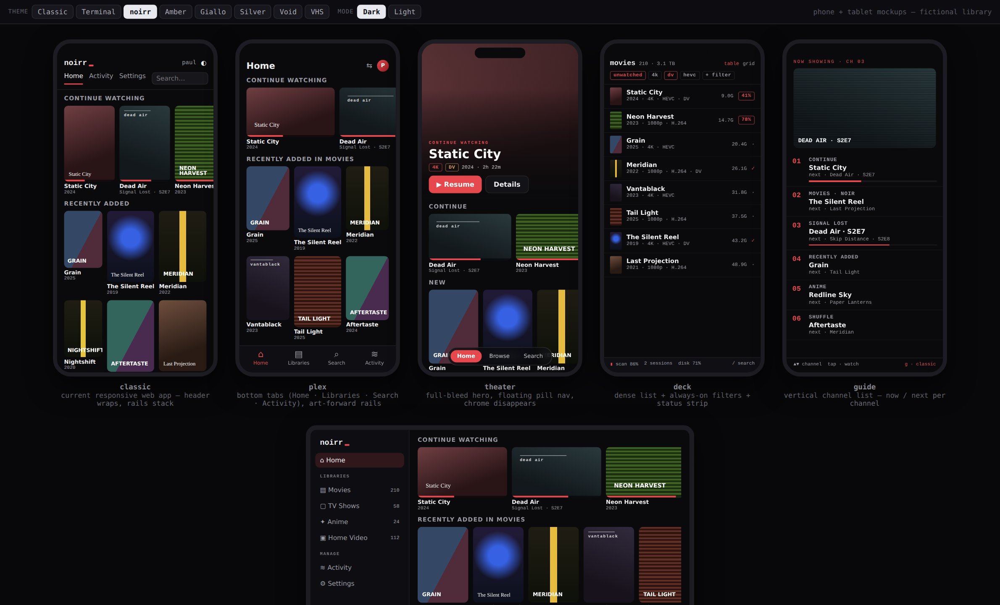
*All five layouts as phones, plus plex-on-tablet. Bottom tabs only for
plex; theater floats a pill; deck keeps its status strip; guide becomes
now/next; iPadOS gets the desktop-class sidebar back.*

Rules of thumb the mockups encode: primary navigation within thumb reach
(bottom) whenever a layout has 3+ destinations on a phone; one-handed
card sizes; the classic layout keeps its shipped responsive behavior
(header wraps at 640px — [index.html:52-60]) untouched.

---

## 6. Draft build plan (for the implementing agent, post-review)

Milestone order is cheapest-risk-first and each is independently
shippable; review may reorder or drop. All web milestones live entirely
in `crates/plurxd/src/web/index.html` (embedded — every change needs
`cargo build` + restart to see). Standing instruction: if a milestone
seems to require a server API change, stop and flag it — none of §3
should need one.

- **M1 — plumbing + the name.** `LAYOUTS` registry, `plurx_layout`
  persistence, `data-layout` attribute, layout section in the appearance
  menu, `[data-layout]` CSS scoping, classic registered as the default.
  Zero visual change on classic. *Accept:* layout menu present; unknown
  stored value falls back to classic; `node --check` on the extracted
  script passes; every existing Playwright/layout assertion green.
- **M2 — `plex` + Amber (web).** Sidebar chrome, hub home, library
  toolbar + A–Z scrubber, backdrop detail, corner flags; Amber token set
  (both modes). *Accept:* all routes render inside the shell; light-mode
  screenshot sweep shows no hardcoded-dark boxes; docs/img regenerated
  for the README if it advertises layouts.
- **M3 — `theater` + Giallo/Silver/Void.** Hero home, chip-bar library,
  full-bleed detail; three token sets (Void wired through `darkOnly`).
  *Accept:* hero picks the newest in-progress item and falls back to
  recently-added when the continue hub is empty; appearance menu shows
  the midnight-only note for Void.
- **M4 — `deck`.** Rail chrome, stat-tile home, **table library view**
  (sortable columns from data already on `list_items` DTOs), spec-sheet
  detail, persistent status footer fed by the existing activity/status
  polls, keyboard map. *Accept:* table sorts client-side without
  re-fetch; status footer live-updates during a scan; no TV offering.
- **M5 — `guide` + VHS.** Channel generation per §3.5's table
  (client-side, date-seeded), preview panel, time ruler, cell sizing by
  remaining runtime; VHS tokens + tracking-bar skeletons. *Accept:*
  same-day reloads produce the same schedule; every cell plays on
  enter/click; non-home routes visibly fall back to classic shells.
- **M6 — clients.** Android/Google TV first (ship order per
  [CLIENTS.md](CLIENTS.md)): extend the three web-matched themes to
  eight, add the plex bottom-tab scaffold and TV rail; then Apple
  (tvOS theater shell per the NOIRR_PLAYER decisions, iPadOS sidebar).
  *Accept:* per-platform screenshot matrix, one row per layout × theme
  the platform offers.

Sizing note for the gate: the embedded `index.html` is ~570 KB today;
five layouts of scoped CSS + four chrome builders is an estimated
+60–90 KB source. Fine for `include_str!`, but extract each `<script>`
and `node --check` it (Rule 4e in project memory), and measure layout
changes with the headless-chromium harness instead of eyeballing.

## 7. Non-goals — guardrails for whoever builds this

- **No server API changes** in M1–M5. Guide's channels are derived
  client-side from existing hubs/library endpoints; if a future channel
  idea needs a server hub, that is a separate proposal.
- **No per-layout players.** One player, projection mode, every layout.
- **No theme renames or removals.** Stored `plurx_theme` ids (`classic`,
  `terminal`, `noirr`) keep working forever; new ids are additive.
- **No route changes.** Deep links and the Plex-compat façade are
  unaffected; layouts are presentation only.
- **No layout-specific settings forms.** Deck frames settings, it does
  not fork them.
- **Mockups are illustration, not pixel law.** Match structure and
  token usage; do not chase mockup pixel dimensions.

## 8. The review checklist — decisions this document needs back

Layouts — which advance to the build plan?

- [ ] `plex` (recommended first — it is the one you asked for by name)
- [ ] `theater`
- [ ] `deck`
- [ ] `guide`
- [ ] rename any of them? (`classic` layout vs Classic theme collision;
      "plex lol" as a permanent name; bikeshed slot: ___________)

Themes — which ship, and under what names?

- [ ] Amber (or insist on calling it "Plex": ☐)
- [ ] Giallo · [ ] Silver (confirm quietly-tinted status colors: ☐ yes
      ☐ make it strict B&W anyway)
- [ ] Void (confirm midnight-only pinning: ☐)
- [ ] VHS
- [ ] signature-theme defaults per §1 table: ☐ as proposed / edits: ____

System decisions:

- [ ] Orthogonal layouts × themes as specced (§2) — confirm
- [ ] Default layout for new users stays `classic` (☐) or becomes one of
      the new ones (____)
- [ ] Per-layout remembered theme choice (§1) — confirm or simplify to
      one global theme
- [ ] Milestone order M1→M6 (§6) — confirm or reorder: ____________
- [ ] Client priority: Android first, Apple second (per CLIENTS.md ship
      order) — confirm or swap

When the boxes are ticked, the accepted subset + §2's contract + §6's
milestones become the implementation plan; the mockups stay in
`docs/mockups/` as the visual reference.
