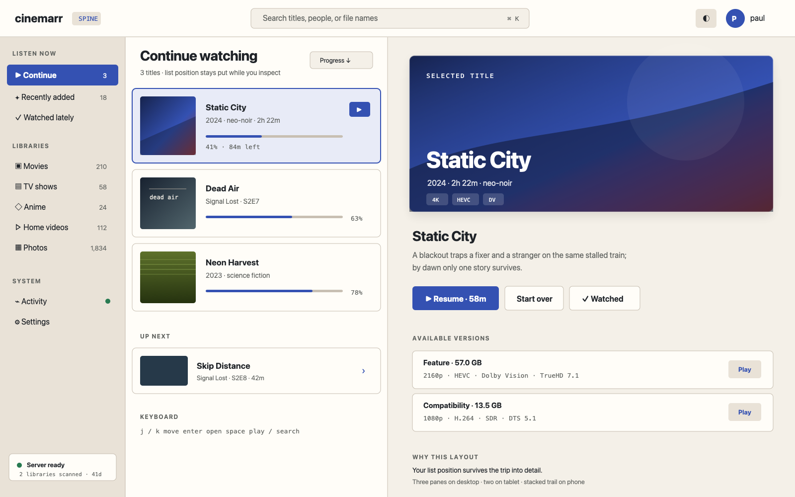
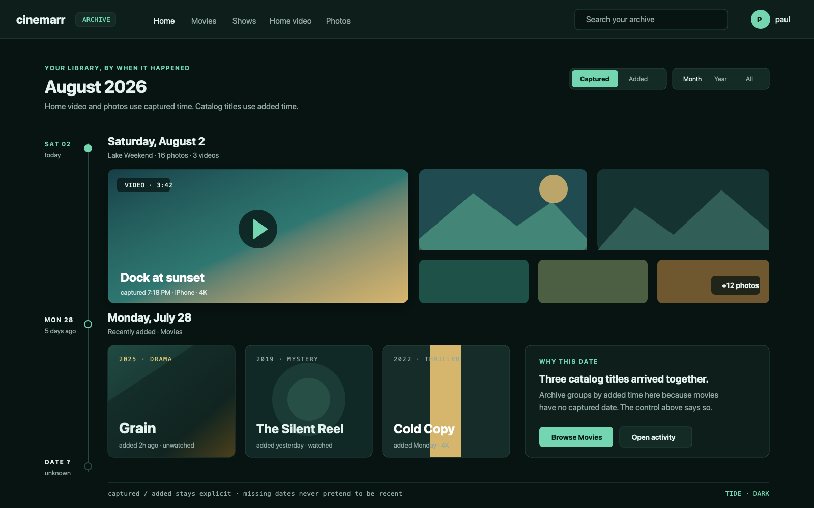
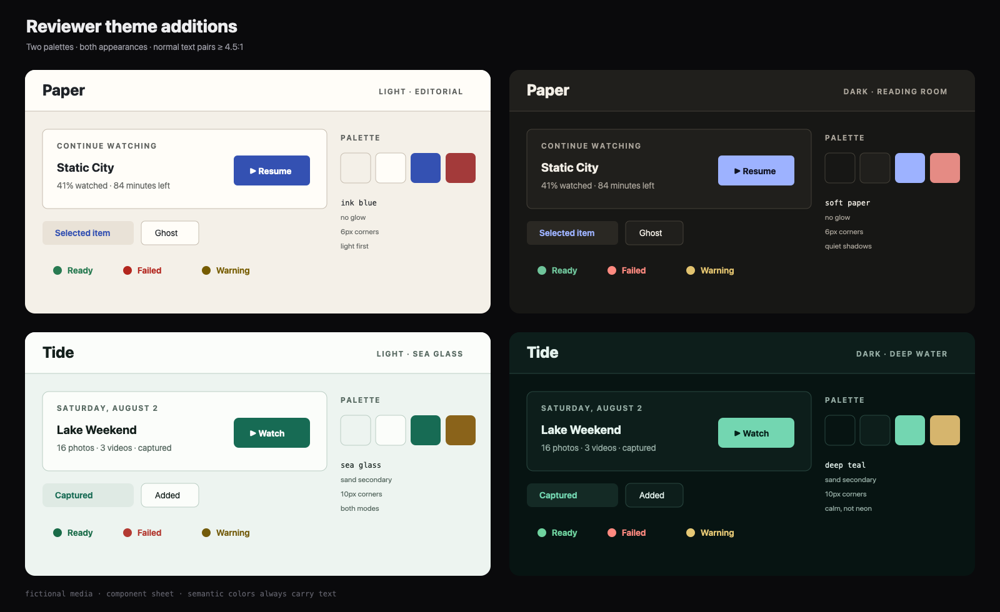

# UI layouts review — ship a smaller, honest first slice

**Status:** review complete · **Reviews:**
[UI-LAYOUTS-PLAN.md](UI-LAYOUTS-PLAN.md) at `56807ae` · **Written:**
2026-08-02 · **Reviewer additions:**
[mockups/review-additions.html](mockups/review-additions.html)

Companion to [UI-LAYOUTS-PLAN.md](UI-LAYOUTS-PLAN.md) (the original
proposal) — this document says what should advance, what needs a corrected
contract, and why. Read the original mockups first. The additions at the end
are candidates, not an argument to put two more layouts into the first
release.

## Verdict — accept the direction, narrow the commitment

The proposal has a real system behind it, not just a mood board. The classic
fallback, unchanged routes, one player, concrete token tables, responsive
sketches, and explicit non-goals are all the right bones. The mockups are good
enough to make trade-offs visible before code exists.

The build plan is not ready as written. `deck` and `guide` depend on data the
current API does not expose, the native-client section describes machinery the
Apple client does not yet have, and several light-theme token pairs fail the
proposal's own accessibility intent. Treat the document as a design catalogue
and advance one vertical slice first.

| Proposal | Verdict | Why |
|---|---|---|
| Layout × theme as two user-facing choices | Accept with a tighter contract | Composition and palette are useful axes, but themes already alter typography, radii, motion, and component treatment. |
| `classic` | Accept | It is the compatibility baseline and safe fallback. |
| `plex` + Amber | Advance as the first pilot | It is the clearest user benefit, has the most complete mockups, and mostly fits current endpoints. |
| `theater` | Keep designed; build after the pilot | The design is coherent, but hero selection, artwork loading, and TV focus need real-device acceptance tests. |
| `deck` | Split into its own feature/API proposal | Its table and footer cannot be built truthfully from the current list and activity DTOs. |
| `guide` | Keep as an experiment | Genre channels, schedule semantics, and remote-control assumptions need decisions before this is a milestone. |
| Five proposed themes | Advance after contrast and motion corrections | The dark variants are strong; several light accents and statuses fail normal-text contrast. |
| One cross-platform M6 | Reject as a single milestone | Web, Android, and Apple start from different theme/navigation architectures and need separate scopes. |

**Recommended first release:** layout plumbing · `classic` · `plex` · Amber
dark/light · web only. That is enough to prove the abstraction without making
every later idea a compatibility promise.

## What the proposal gets right — preserve these decisions

1. **One route and player contract.** Layouts must not fork playback, auth,
   URLs, or data ownership. That prevents five visual shells from becoming
   five applications.
2. **`classic` is the unknown-value fallback.** A stale preference must open a
   familiar app, not a blank shell.
3. **The mockups use fictional media.** They are safe to publish and still
   exercise long titles, badges, missing art, tables, focus, and responsive
   navigation.
4. **TV is treated as a different interaction surface.** The proposal does
   not merely scale desktop down to ten feet.
5. **Deck declines TV.** Capability-based availability is better than a bad
   universal promise.
6. **Playback stays true black.** The picture is content, not a theme swatch.

## Contract corrections — fix these before implementation

### `deck` needs list metadata and honest session telemetry

The proposed library table names `video`, `hdr`, `audio`, and `size` as fields
already present on list items. They are not. The browse
[`ItemDto`](../crates/plurxd/src/http/dto.rs) exposes a best-file
`resolution`; codec, HDR, audio streams, and file size live on `FileDto`, which
is returned by item detail. Fetching every item detail to paint a table would
turn one library page into an N+1 request fan-out.

The status footer also promises `direct · remux · transcode` sessions from the
existing activity poll. [`activity_detail`](../crates/plurxd/src/http/system.rs)
calls `transcode.list_sessions()`, and the current UI correctly says that
direct play and remux do not hold server sessions. `/system` has uptime and
storage diagnostics, but it is admin-only and does not expose the mockup's
simple whole-disk percentage as a household status field.

Choose one honest contract:

1. Add a paginated operator-list DTO with aggregated file facts and a playback
   registry that accounts for all delivery methods; then Deck is an API-backed
   feature.
2. Keep M1–M5 client-only, but remove those columns and show only transcodes,
   scans, and data already present on browse responses.

The first option makes Deck worth shipping. The second makes it a denser skin,
not the operator console shown in the mockup.

### `guide` has no genre source and no complete schedule contract

Catalog items do not currently carry movie/TV genres. `ItemDto.tags` is the
free-form field for home media; NFO genres are deliberately folded into those
home-media tags. The `MOVIES · <genre>` channel therefore cannot be derived
from existing hubs or library DTOs.

The schedule also needs rules for facts the mockup currently leaves implicit:

- Which timezone owns the date seed?
- Does a program start at its synthetic slot or at the user's saved position?
- What fills a channel when runtimes are missing?
- How are episodes ordered when a season has gaps?
- How many pages may the client fetch before it has sampled the whole library?
- Does “same day” mean stable after watch progress and library contents change?

Number keys and colored remote buttons are optional enhancements, not core
controls. Current Apple TV and Google TV remotes cannot be assumed to expose
either. Every Guide action needs a D-pad path and an on-screen label.

### Layout and theme are coupled, just at a safer boundary

The sentence “layout is structure; theme is paint” is a useful teaching model,
but it is not the shipped contract. Terminal changes radii, shadows, nav
punctuation, headers, empty states, table rules, cursor animation, and casing.
Noirr changes wordmarks, grain, hover behavior, and loading indicators. The
proposal itself lets layouts own card shapes while themes own `--radius`.

Use this boundary instead:

| Axis | Owns | Must not own |
|---|---|---|
| Layout | navigation scaffold · page composition · density · information hierarchy · supported surfaces | palette values · semantic status meaning · playback behavior |
| Theme | palette · type family · corner/shadow treatment · decorative texture · brand lockup | DOM order · route availability · hidden information · input behavior |
| Accessibility preference | reduced motion · increased contrast · text scaling · forced-colors behavior | brand identity · saved layout selection |

“Every combination is supported” should mean every combination remains
legible and operable. It need not mean every pairing is equally pretty.

### The renderer needs a page model, not only a chrome callback

The current web views in
[`index.html`](../crates/plurxd/src/web/index.html) own the whole sequence:
install chrome, fetch route data, assemble HTML, replace `main`, and wire
behavior. The draft diagram assumes each view already returns a reusable body.
It does not.

A layout registry introduced directly around the existing functions will
either duplicate fetches or make layout renderers reach into route-specific
globals. Split each route at one seam:

```text
hash route
   │
   ▼
loadPage(route) ──▶ normalized page model ──▶ layout.render(page)
                                                │
                                                ▼
                                      shared behavior wiring
```

Do this route by route, beginning with Home. Do not rewrite every screen before
the Plex pilot proves the model. Activity, settings, auth, and the player can
continue using their existing renderers behind the layout shell.

### Theme persistence currently has two incompatible specifications

Section 1 says a theme choice is remembered per layout. Section 2 mirrors the
existing single `localStorage.plurx_theme` key. Those are different products.

Use one global theme in the first release. A layout's signature theme should
be a preview/recommendation, not an automatic mutation: selecting Plex must
not silently replace a user's chosen noirr theme. Per-layout memory adds a
mapping schema, migration rules, and a menu state that are not buying enough
in M1.

If per-layout memory is added later, specify one versioned value such as:

```json
{"v":1,"classic":"noirr","plex":"amber"}
```

Unknown layout/theme ids are ignored independently; the global theme remains
the fallback.

## Accessibility review — visual polish is not the acceptance gate

The dark palettes have comfortable contrast. Three proposed light-mode values
need correction before they become contract values:

| Pair | Measured contrast | Result |
|---|---:|---|
| Amber light accent `#c8880a` on `#f3f4f6` | 2.73:1 | Fails 4.5:1 normal text |
| Amber light white button ink on `#c8880a` | 3.01:1 | Fails 4.5:1 normal text |
| Amber light good `#238a5e` on `#f3f4f6` | 3.92:1 | Fails 4.5:1 normal text |
| Amber light bad `#c93f38` on `#f3f4f6` | 4.49:1 | Misses 4.5:1 normal text |
| Giallo light accent `#a8720c` on `#f5eed9` | 3.57:1 | Fails 4.5:1 normal text |
| Giallo light white button ink on `#a8720c` | 4.14:1 | Fails 4.5:1 normal text |
| Giallo light good `#35855c` on `#f5eed9` | 3.89:1 | Fails 4.5:1 normal text |
| Silver light warning `#8a7442` on `#f4f4f2` | 4.09:1 | Fails 4.5:1 normal text |

Safe starting replacements are Amber light `--accent: #8b5e00`,
`--good: #246b49`, `--bad: #bd332d`; Giallo light `--accent: #7f4e00`,
`--good: #2c734d`; and Silver light `--warn: #765f28`. Re-run contrast on the
actual mixed backgrounds; token-to-background checks do not prove every
component state.

Add these acceptance checks to every layout milestone:

- Every route works by keyboard alone, with a visible focus indicator that is
  not color-only.
- Rails, grids, tabs, tables, dialogs, and menus expose their actual semantics;
  a visual `div` that looks selected is not enough.
- `prefers-reduced-motion` removes cursor blinking, tracking bars, parallax,
  focus zoom, and decorative transitions.
- `forced-colors` keeps selection, progress, and focus visible.
- Text remains usable at 200% zoom and native accessibility sizes.
- Hover-only captions have an equivalent for touch, keyboard, and TV focus.
- Empty, loading, partial-data, error, non-admin, and missing-art states are in
  the screenshot/interaction matrix.

## Native clients — make three plans, not one port

Android does have selectable Classic, Terminal, and noirr preferences, but it
uses a custom `ViewerColors` layer plus Material `ColorScheme`; it is not a
direct CSS-token port. See
[`Theme.kt`](../clients/android/app/src/main/java/tv/plurx/app/ui/theme/Theme.kt).

Apple currently has a static noirr [`Palette`](../clients/apple/Sources/Theme.swift)
and forces dark appearance in
[`PlurxApp.swift`](../clients/apple/Sources/PlurxApp.swift). There is no
three-theme selection system to extend. Apple theme persistence, environment
injection, settings UI, light appearance, and screenshots are foundation work
before any five-theme catalogue.

Create separate milestones:

1. **Web:** prove the registry and one alternate layout.
2. **Android:** generate `ViewerColors` from the accepted token source, then
   add navigation scaffolds one form factor at a time.
3. **Apple:** introduce theme/appearance infrastructure first; tvOS layout work
   stays independent from iPhone/iPad navigation work.

One canonical data file should generate web, Kotlin, and Swift palette values.
Hand-copying eight themes × two modes × three clients guarantees drift.

## Revised build gates — each promise earns its way in

### G0 — freeze the compatibility baseline

Capture `classic` screenshots at desktop/mobile breakpoints and route tests for
Home · library · category · search · detail · activity · settings · auth ·
player. Record keyboard focus order and non-admin behavior.

**Accept:** the baseline is deterministic enough to catch a visual or route
regression.

### G1 — add the registry without changing pixels

Add `plurx_layout`, `data-layout`, capability filtering, and a layout section
in appearance settings. Keep one global theme. Unknown/unsupported ids fall
back to Classic and are not shown as selectable.

**Accept:** the G0 matrix is unchanged under `classic`.

### G2 — ship the Plex web pilot

Implement Plex Home, one library route, and one item-detail route with Amber
dark/light. Share route loaders and behavior wiring; do not fork API calls.

**Accept:** the full route matrix remains operable, contrast passes, light mode
has no hardcoded-dark surfaces, and a library with 0 · 1 · 200+ items works.

### G3 — decide whether the abstraction paid for itself

Measure duplicated markup, extra requests, source size, route regressions, and
the cost of fixing one shared card behavior in both layouts. Simplify the
contract before adding another layout if the pilot exposed leaky boundaries.

**Accept:** a short decision record says “continue”, “revise”, or “stop” and
names the evidence.

### G4 — add one second layout, not the remaining catalogue

Choose Theater, Spine, or another candidate based on the desired next surface.
Deck and Guide do not enter this gate until their API/product contracts above
are resolved.

**Accept:** the second implementation requires no business-logic fork and no
layout-specific data fetch outside its registered loader.

### G5 — plan clients independently

Port only accepted themes/layouts and keep platform-native navigation. A web
layout id is not automatically a promise that the same id exists on every
device.

**Accept:** each client publishes its supported-layout capability table and
falls back locally without rewriting the saved preference.

## Reviewer additions — two gaps worth exploring

These designs live in
[`mockups/review-additions.html`](mockups/review-additions.html). They use the
same fictional catalogue as the original mockups.

### `spine` — keep the list and the detail in view

**What it is:** a three-pane browser for desktop and tablet: sources on the
left, the current result set in the middle, and a persistent inspector on the
right. Opening a title changes the URL and inspector without destroying the
list position. It is Finder/Apple Music muscle memory applied to a media
library, not an operator console: no disk/session telemetry and no codec table
on the Home screen.

**Why it fills a gap:** Classic/Plex repeatedly move between grid and detail;
Theater intentionally trades context for immersion; Deck trades it for
operations. Spine optimizes comparison and browsing continuity. It works with
current library-list and item-detail endpoints and makes keyboard and large
text behavior easier to reason about.

**Surface rules:** desktop + tablet · phone collapses to source → list → detail
with a visible back trail · TV does not offer it · activity/settings keep the
Spine shell around their shared bodies.


*Spine × Paper-light — source, list, and inspector remain visible together.*

### `archive` — personal media gets a first-class home

**What it is:** a chronological journal that replaces Home, grouping home
video and photos by `recorded_at` and catalog media by `added_at`. Date rails,
event-sized tiles, and mixed photo/video clusters make “what happened when?”
the primary browse question. A Captured/Added switch says which clock owns the
timeline instead of quietly mixing two meanings.

**Why it fills a gap:** every original layout is excellent at movies and TV;
home videos/photos mostly inherit a grid. Archive uses fields plurx already
stores and makes the mixed-media promise visible. Like Guide, it replaces Home
only; standard browse and detail routes remain available.

**Surface rules:** web · tablet · phone becomes a single vertical journal · TV
falls back to Classic · missing dates go in an explicit “Date unknown” group,
never at the top as if they were recent.


*Archive × Tide-dark — one timeline, with captured and added time kept honest.*

### `paper` — a light-first editorial theme

Paper is warm stock, graphite text, and an ink-blue accent. Its dark mode is a
reading room rather than inverted white. It deliberately has no grain, glow,
or animated brand treatment. Signature pairing: Spine.

| token | light | dark |
|---|---|---|
| bg / panel / panel2 | `#f4f0e8` / `#fffdf8` / `#e9e2d7` | `#171715` / `#201f1c` / `#2a2823` |
| line | `#c8bfb2` | `#454139` |
| text / muted / prose | `#1f2328` / `#5f625f` / `#3d4248` | `#f2eee6` / `#aaa49a` / `#d6d0c6` |
| accent / accent2 | `#3451b2` / `#a33a3a` | `#9db2ff` / `#e58b84` |
| good / bad / warn | `#287a51` / `#b3261e` / `#765c00` | `#6fc49a` / `#ff8a80` / `#e2c36f` |
| radius / btn-ink | `6px` / `#ffffff` | `6px` / `#101322` |

### `tide` — deep teal without synthwave neon

Tide is sea-glass green on deep blue-green, with a sand secondary accent. It
adds a calm color family missing from the red · gold · blue · magenta set and
works in both appearances. Signature pairing: Archive.

| token | light | dark |
|---|---|---|
| bg / panel / panel2 | `#edf4f0` / `#fbfdfa` / `#dfeae4` | `#071412` / `#0d1e1b` / `#142a25` |
| line | `#bccfc5` | `#2a4841` |
| text / muted / prose | `#14201c` / `#586a62` / `#34473f` | `#e4f2ed` / `#93aaa2` / `#c8dcd5` |
| accent / accent2 | `#176b54` / `#8a631a` | `#73d6b1` / `#d6b56d` |
| good / bad / warn | `#196b48` / `#b33a32` / `#735b0b` | `#6fd39f` / `#ff8a80` / `#e5c875` |
| radius / btn-ink | `10px` / `#ffffff` | `10px` / `#052019` |

Every normal text, muted text, accent, status, and accent-button pair in these
four palettes is at least 4.5:1 against its primary background. The visual
sheet shows both appearances:


*Paper and Tide — light and dark component samples, with the same semantic
status colors in every showtime.*

## Decision checklist — the shorter answer

- [x] Keep layout and theme as separate settings, with the corrected boundary.
- [x] Keep `classic` as the default and unknown-value fallback.
- [x] Advance `plex` + Amber as the web pilot.
- [ ] Correct Amber/Giallo/Silver light tokens before freezing values.
- [ ] Choose one global theme for M1; defer per-layout theme memory.
- [ ] Give Deck an API proposal or reduce its promised telemetry.
- [ ] Define Guide's metadata, scheduling, and D-pad-only contract.
- [ ] Split web, Android, and Apple into separate milestones.
- [ ] After the Plex pilot, choose Theater or Spine as the second proof of the
      renderer contract.
- [ ] Decide whether Archive earns a Home experiment for home-video/photo
      libraries.

The original catalogue should remain intact. The implementation plan should be
distilled from the boxes above, not copied wholesale from §6 of the proposal.
